# LitClock

[](https://github.com/gkoch02/litclock/actions/workflows/ci.yml)

LitClock is a literary clock built from public-domain text. It picks a quote that matches the current fuzzy time bucket, renders it into an 800×480 image, and can push that image to an eInk display such as the Pimoroni Inky Impression 7.3.


## Table of contents

- [What this repo is](#what-this-repo-is)
- [How LitClock was built](#how-litclock-was-built)
- [Repo map](#repo-map)
  - [Runtime](#runtime)
  - [Runtime assets](#runtime-assets)
  - [Build and corpus tools](#build-and-corpus-tools)
  - [Other important paths](#other-important-paths)
- [Runtime data contract](#runtime-data-contract)
- [Quick start](#quick-start)
  - [Local setup](#local-setup)
  - [Render once locally (smoke test)](#render-once-locally-smoke-test)
  - [Set up the config file](#set-up-the-config-file)
  - [Run the clock loop](#run-the-clock-loop)
  - [Render once and push to the Inky display](#render-once-and-push-to-the-inky-display)
  - [Themes](#themes)
  - [Inky buttons (short and long press)](#inky-buttons-short-and-long-press)
  - [Persisted runtime state and telemetry](#persisted-runtime-state-and-telemetry)
  - [Startup frame](#startup-frame)
  - [Curator web UI](#curator-web-ui)
  - [Quiet hours](#quiet-hours)
- [Testing](#testing)
- [Raspberry Pi deployment](#raspberry-pi-deployment)
  - [Fresh Pi setup](#fresh-pi-setup)
  - [Existing Pi update flow](#existing-pi-update-flow)
  - [Example service](#example-service)
  - [Install the service](#install-the-service)
- [Build pipeline notes](#build-pipeline-notes)
- [Operational notes](#operational-notes)
- [Useful files when something breaks](#useful-files-when-something-breaks)
- [Contributing and security](#contributing-and-security)

## What this repo is

This repo contains both:

- the **runtime clock** that picks and renders quotes for the current time
- the **corpus/build tooling** used to mine, clean, enrich, and improve the quote dataset

If you are deploying or operating the clock, you mostly care about the runtime and the prebuilt assets in `assets/`.

## How LitClock was built

At a high level, the project came together in stages:

1. mine public-domain books for phrases like "quarter past seven" or "ten minutes to midnight"
2. clean raw matches into displayable quotes
3. enrich, attribute, and score the candidates
4. organize them into fuzzy time buckets
5. pick the best quote for the current bucket at runtime, with nearby fallback when needed
6. render the result into an image tuned for the target eInk display

That build pipeline is how the runtime quote set came to exist. The clock itself then uses the prebuilt dataset and render loop to turn that corpus work into a live display.

## Repo map

### Runtime

- `litclock_cli.py` - **unified `litclock <subcommand>` entry point** (v2). Wraps every script below in one discoverable command; `pip install -e .` registers `litclock` as a console script. Backwards-compatible — `python3 <script>.py` still works for every subcommand.
- `run_clock.py` - long-running clock loop, bucket-change refresh logic, optional display handoff
- `runtime_*.py` - the seven siblings `run_clock.py` delegates to: `runtime_state` / `runtime_store` / `runtime_telemetry` / `runtime_quiet` / `runtime_theme` / `runtime_actions` / `runtime_log` (architecture in [`CLAUDE.md`](CLAUDE.md))
- `runtime_webhook.py` - v2 alert-firehose: posts alert-worthy telemetry events to an operator-configured HTTP endpoint on a daemon thread (errors, backoff, timeouts, button-died); never blocks the render path
- `render_quote.py` - quote renderer, typography, highlighting, theme handling, Spectra 6 palette snapping
- `pick_quote.py` - runtime quote selection from the attributed dataset
- `display_inky.py` - thin bridge that sends a rendered image to the Inky display
- `inky_buttons.py` - listener for the four Inky Impression capacitive buttons (A/B/C/D), short + long press, liveness check
- `probe_buttons.py` - standalone GPIO press probe for verifying which pin each physical button fires
- `litclock_health.py` - summarises the telemetry sidecar (render count, p50/p95 latency, last error); supports `--json`, reads date-rotated files
- `buckets.py` - fuzzy time bucket mapping (single source of truth — every other script imports from it)
- `atomic_io.py` - shared atomic-write primitive (tmp → fsync → rename → fsync dir) used by every file the next tick reads
- `pidfile.py` - single-instance `fcntl.flock` pidfile so overlapping `systemctl restart` cycles can't race
- `sd_notify.py` - pure-stdlib systemd `READY=1` / `WATCHDOG=1` client; no-op when `$NOTIFY_SOCKET` is unset
- `web_server.py` + `web/` - optional local curator UI (off by default; enable with `--web-bind`). v2 adds full corpus search, per-row content overrides editor, in-UI re-bake, side-by-side theme preview, gap finder, first-run wizard, Prometheus `/metrics`, mobile-first four-tab layout

### Runtime assets

- `assets/quote_database.jsonl` - **baked, display-ready runtime DB** (what the clock reads by default; produced by `bake_quote_database.py`)
- `assets/candidates-attributed.jsonl` - raw attributed corpus (baker input; curator-UI bucket inspector + full-text search; defensive fallback if the baked DB is missing)
- `assets/selection_overrides.json` - selection tweaks/overrides used at runtime (bans, boosts, preferred buckets, **per-row bans via `ban_quote_keys` (v2)**; editable via the curator UI)
- `assets/content_overrides.json` - per-row hand fixes layered onto the corpus at bake time; editable from the curator UI (v2) followed by `POST /api/bake` to make the edits visible
- `assets/goodnight.png` - pre-rendered dark-theme "good night" frame shown during quiet hours
- `assets/preview.png` - README preview image

### Build and corpus tools

The full pipeline order is documented in [Build pipeline notes](#build-pipeline-notes); the scripts themselves are:

- `gutenberg_time_miner.py` - harvest time-phrase candidates from Project Gutenberg or local `.txt` files
- `merge_candidates.py` - dedupe and merge multiple harvest runs
- `clean_display_quotes.py` - normalise raw matches into a displayable excerpt
- `quality_filter.py` - score rows and append quality flags
- `enrich_metadata.py` - attach title / author from cached Gutenberg headers
- `apply_content_overrides.py` - layer per-row hand fixes from `assets/content_overrides.json`
- `bake_quote_database.py` - final stage; produces `assets/quote_database.jsonl`, the runtime DB
- `bucket_coverage.py` - report which fuzzy buckets are sparse or empty
- `target_sparse_buckets.py` - targeted sweep for the buckets `bucket_coverage.py` flagged
- `import_targeted_hits.py` - reshape targeted hits so `merge_candidates.py` can absorb them
- `fix_substring_time_matches.py`, `fix_legacy_buckets.py` - one-shot migration tools for corpus rows from earlier miner revisions; no-ops on fresh harvests

### Other important paths

- `tests/` - automated tests (one module per script, plus golden fixtures under `tests/golden/`)
- `output/` - generated output and analysis artifacts, not canonical runtime source
- `fonts/` - bundled OFL typefaces used by the renderer (Playfair Display, Bitter, Old Standard TT, Space Mono, Archivo, EB Garamond, UnifrakturMaguntia, Jost, Rubik, Bangers — one per theme)
- `litclock.service.example` - example systemd service for Pi deployment
- `pi_setup_inky_impression.md` - Pi setup notes
- `bootstrap_pi_inky.sh` - helper bootstrap script for Pi setup
- `Dockerfile` + `.dockerignore` - v2 multi-stage OCI build (ARM64-first, Pi-runtime extra not bundled). `docker buildx build --platform linux/arm64,linux/amd64 -t litclock:2.0 .`
- `CONTRIBUTING.md`, `SECURITY.md`, `CODE_OF_CONDUCT.md` - process and policy docs
- `FOLLOWUPS.md` - deferred-work list (carved out of larger PRs to keep them focused)

## Runtime data contract

For normal runtime use, the clock expects prebuilt assets and does **not** need raw Gutenberg texts to render quotes. The canonical runtime input is `assets/quote_database.jsonl` — the display-ready DB baked from the raw corpus with scoring pre-computed. Everything else in `assets/` is either the raw corpus the baker reads, a hand-edited sidecar, or a build-time artifact.

| Path | Role | Committed | Ships to Pi | Produced by |
|---|---|---|---|---|
| `assets/quote_database.jsonl` | **baked display-ready DB — the runtime picker reads this** | yes | yes | `bake_quote_database.py` (CLI or web UI `POST /api/bake`) |
| `assets/candidates-attributed.jsonl` | raw attributed corpus | yes | yes (baker input + curator UI + fallback) | `enrich_metadata.py` → `apply_content_overrides.py` |
| `assets/content_overrides.json` | per-row hand fixes (source-of-truth) | yes | no (build-time only) | hand-edited or web UI `POST /api/content-overrides` |
| `assets/selection_overrides.json` | bans / boosts / preferred buckets / per-row bans (runtime-editable) | yes | yes | hand-edited or web UI `POST /api/overrides` |
| `assets/bucket-coverage.{json,md}` | coverage snapshot | yes | optional | `bucket_coverage.py` |
| `~/.litclock/state.json` | manual theme / quiet override | — | runtime, per-appliance | `run_clock.py` |
| `~/.litclock/history.jsonl` | anti-repeat ledger | — | runtime, per-appliance | `run_clock.py` |
| `~/.litclock/telemetry-YYYYMMDD.jsonl` | render / error telemetry | — | runtime, per-appliance | `run_clock.py` |

Read it as: `candidates-attributed.jsonl` + `content_overrides.json` are the **source of truth**; `quote_database.jsonl` is **derived** (regenerated by the baker) and is what the clock actually reads; the `~/.litclock/*` files are **per-appliance runtime state**. Treat `data/` and the mining/enrichment scripts as build-time tooling, not service startup dependencies.

If you are only updating the clock on a Pi, you should not need to rebuild the corpus on-device — the baked DB already ships in the repo.

## Quick start

### Local setup

Create a virtual environment and install dependencies:

```bash
python3 -m venv .venv
source .venv/bin/activate
pip install -e '.[dev]'
```

### The `litclock` CLI (v2)

After `pip install -e .` the project ships a single `litclock` command
that dispatches to every script in the repo:

```bash
litclock --help                          # list every subcommand
litclock run --display-script display_inky.py
litclock render --time 14:30
litclock pick --bucket h3_half_past
litclock health --hours 24 --json
litclock bake
litclock contact-sheet --output output/contact-sheet.png
```

`litclock <sub> --help` forwards to the backing script's argparse so the
flag list is identical to `python3 <sub>.py --help`. The umbrella CLI is
purely additive — every `python3 <script>.py` invocation in the rest of
this doc continues to work unchanged.

### Render once locally (smoke test)

Zero-setup sanity check — renders one frame using argparse defaults and
writes it to `output/current.png`:

```bash
python3 run_clock.py --once
# or, with the unified CLI (v2):
litclock run --once
```

### Set up the config file

Anything beyond that smoke test should use a TOML config file. The
repo ships two of them:

- **`assets/config.toml.example`** — opinionated appliance preset
  (production mode, `auto` theme, `/var/lib/litclock/` paths,
  `systemctl poweroff` shutdown). This is what `litclock.service.example`
  expects; copy it verbatim for Pi deployments and tweak from there.
- **`assets/config.toml.defaults`** — every key set to the value
  `run_clock.py` would use with no `--config` at all. Copying this
  verbatim is behaviourally a no-op; use it when you want an explicit,
  reviewable reference you can check into your deployment repo and
  diff against future upstream bumps.

```bash
# Dev machine: start from the defaults and tweak
mkdir -p ~/.litclock
cp assets/config.toml.defaults ~/.litclock/config.toml
$EDITOR ~/.litclock/config.toml
```

Every key maps 1:1 to an argparse `dest` (snake_case — `display_script`,
`quiet_start`, `web_bind`, etc.), so anything you'd pass on the CLI can
live in the file. Precedence is **CLI flag > config value > argparse
default**, so ad-hoc one-offs like `--once` or `--mode debug` still
work on top of a shipped config. Three transient flags are deliberately
refused in the file (`--once`, `--skip-preflight`, and `--config`
itself) — listing them warns and drops.

**One asymmetry to know about.** `store_true` flags — `buttons_off`,
`quiet_off` — can only be *enabled* from the CLI; there is no paired
`--buttons-on`. So a config with `buttons_off = true` cannot be
overridden from the command line for a one-off run. Leave boolean
toggles out of the config unless you want them permanent, or comment
them back out when you need CLI flexibility.

Fail-open on malformed / unreadable / schema-mismatched content (warns
to stderr, keeps running with argparse defaults); the one hard error is
pointing `--config` at a non-existent path, so a typoed unit-file path
fails fast in the journal instead of silently booting with defaults.

The shipped `litclock.service.example` passes `--config %S/litclock/config.toml`
exclusively — so tuning the appliance is a file edit plus `systemctl
restart`, no `daemon-reload` needed.

### Run the clock loop

Once your config is staged, this is the canonical command. It reads
every runtime knob (render script, display push, theme, quiet hours,
etc.) from the file:

```bash
python3 run_clock.py --config ~/.litclock/config.toml
```

### Render once and push to the Inky display

Same config, `--once` on top for a one-shot render-and-push (useful for
cron / bring-up):

```bash
python3 run_clock.py --config ~/.litclock/config.toml --once
```

If you haven't staged a config yet, the equivalent ad-hoc CLI form is:

```bash
python3 run_clock.py --once --display-script display_inky.py --mode production
```

### Themes

Twenty-four themes ship built-in, all constrained to the Spectra 6 panel palette (white / black / red / yellow / blue / green). Each theme pairs its palette with a dedicated typeface. Previews use a fixed quote so palette + typography are the only variables; production renders adapt layout to the picked line.

| `--theme`     | Preview | Page bg | Body  | Accent | Typeface             | Feel                          |
|---------------|---------|---------|-------|--------|----------------------|-------------------------------|
| `default`     |          | white       | black | red    | Playfair Display     | Classic broadsheet            |
| `dark`        |                | black       | white | yellow | Playfair Display     | Night mode                    |
| `scholar`     | 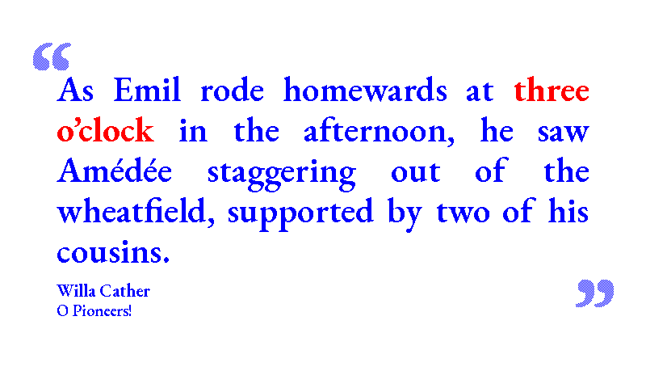         | white       | blue  | red    | Bitter (slab)        | Academic textbook             |
| `newsprint`   | 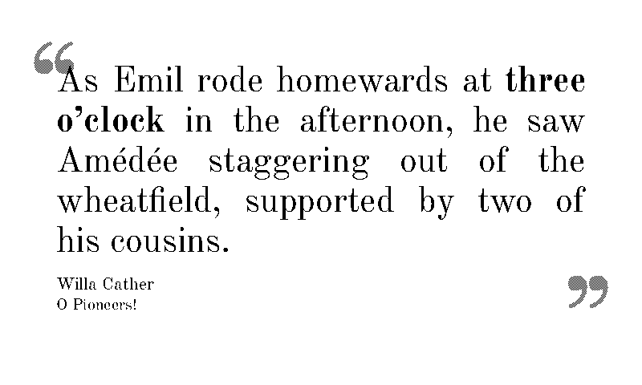     | white/black | black | (none) | Old Standard TT      | Bold-weight, no chroma        |
| `nightvision` | 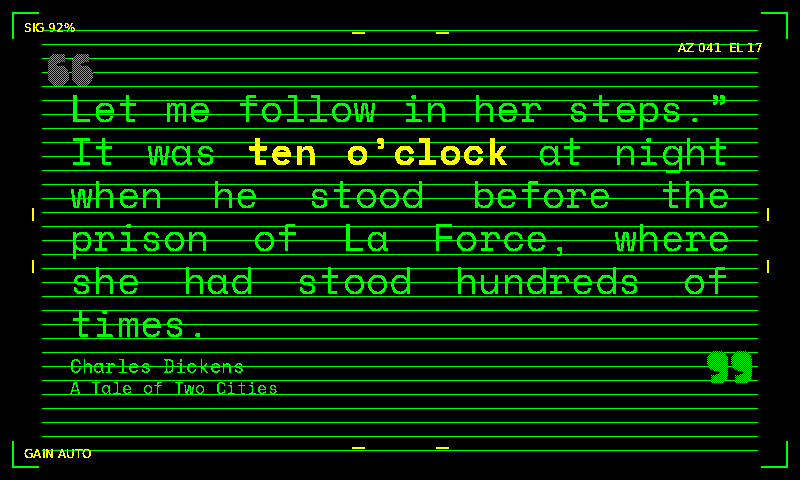 | black       | green | yellow | Space Mono           | Retro terminal                |
| `blueprint`   | 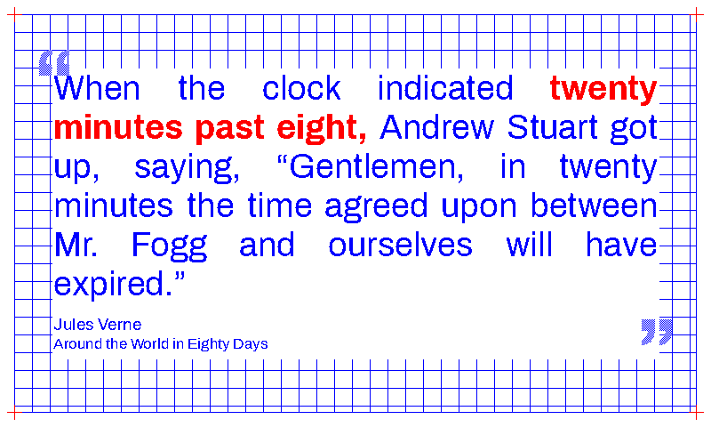     | blue/white  | white | red    | Archivo (sans)       | Cyanotype drafting sheet      |
| `illuminated` | 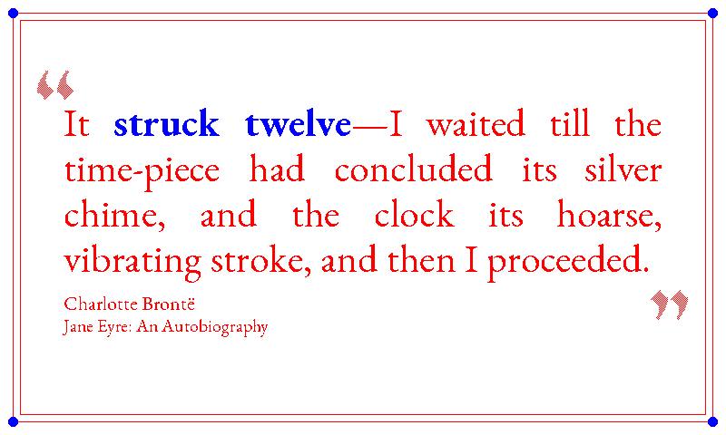 | white       | red   | blue   | EB Garamond + UnifrakturMaguntia | Rubricated manuscript |
| `gothic`      | 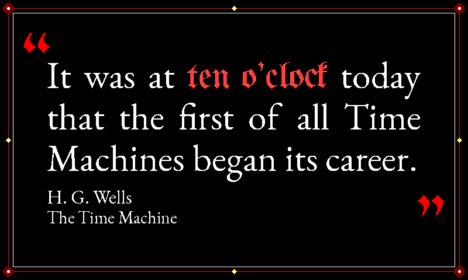           | black       | white | red    | EB Garamond + UnifrakturMaguntia | Cathedral chronicle   |
| `bauhaus`     |          | white       | black | blue   | Jost (geometric sans) | Bauhaus poster               |
| `risograph`   |      | white       | red   | blue   | Rubik (rounded sans) | Two-colour riso zine          |
| `comic`       |              | yellow      | black | red    | Bangers (comic)      | Golden-age comic panel        |
| `dispatch`    | 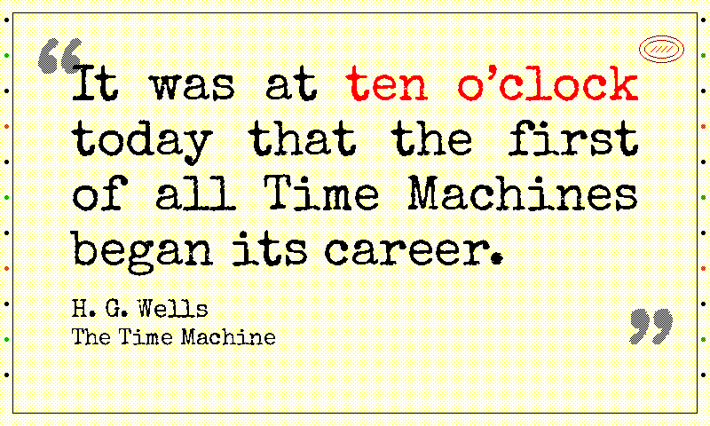       | white       | black | red    | Special Elite (typewriter) | Vintage field dispatch  |
| `atomic`      |            | green/white | black | red    | Atomic Age           | Mid-century Sputnik age       |
| `marker`      |            | white       | black | blue   | Permanent Marker     | Fridge-doodle Sharpie         |
| `saloon`      |            | white       | black | red    | Rye (wood-engraved slab) | Wild West wanted-poster   |
| `roman`       | 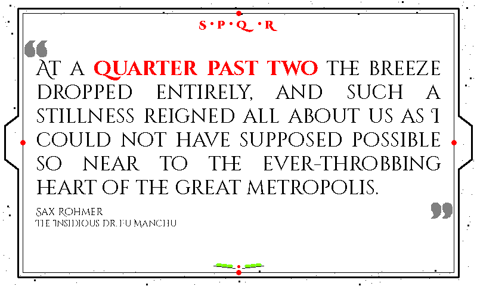             | white       | black | red    | Cinzel Decorative    | Roman lapidary inscription    |
| `alchemy`     |          | yellow/white | black | red   | IM Fell English + MedievalSharp | Parchment grimoire     |
| `grimoire`    | 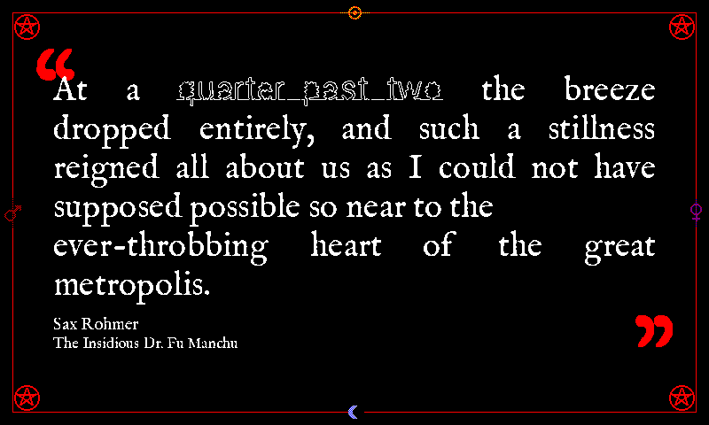       | black       | white | red    | IM Fell English + TFoustScript | Faustian spellbook       |
| `deco`        |                | white       | black | red    | Righteous (display sans) | 1930s art-deco poster     |
| `glacier`     | 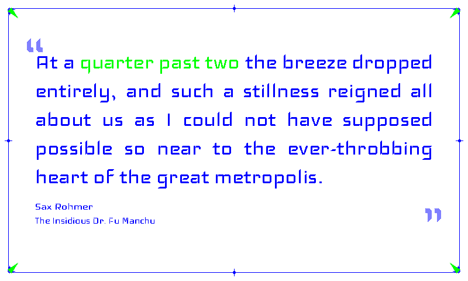         | white       | blue  | green  | Iceland (techno display) | Icy / aurora panel        |
| `chalkboard`  | 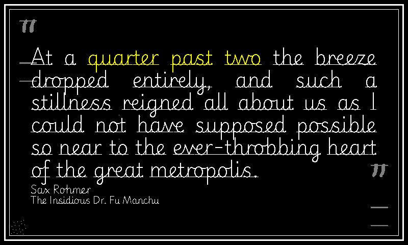   | black       | white | yellow | Playwrite GB J Guides | Primary-school cursive guides |
| `placard`     |          | white       | black | red    | Patrick Hand SC      | Hand-lettered sandwich board  |
| `chanbara`    |        | black       | white | red    | Shojumaru (brush)    | Samurai-cinema poster         |
| `diags`       | 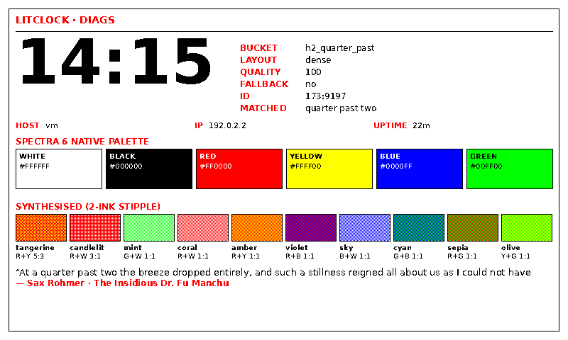             | white       | black | red    | DejaVu Sans          | Calibration / status panel    |

`diags` replaces the literary frame with a status panel — big clock + picker metrics (bucket / layout / quality / source / matched phrase), a `HOST` / `IP` / `UPTIME` strip, the Spectra 6 native palette, and the synthesised 2-ink stipple recipes documented in [`CLAUDE.md`](CLAUDE.md). Useful for on-panel colour calibration ("does `mint` actually read as green at viewing distance?") and for confirming the picker chose what you'd expect. It is **excluded from `--theme random`** (a random pick replacing the literary frame with a swatch screen would be surprising); manual selection via button B / web dropdown still works.

Pass `--theme auto` to let the clock pick by wall-clock time. The defaults are `default` during the day (06:00–18:00) and `dark` at night (18:00–06:00) — the legacy binary contract. Broaden the rotation by setting `--auto-day-theme` and/or `--auto-night-theme` to any other registered theme, e.g.

```bash
python3 run_clock.py --theme auto --auto-day-theme scholar --auto-night-theme nightvision
```

`auto` itself is rejected for the day/night picks (would be a config typo, not a useful recursion). A manual button-B press (or a web-UI dropdown jump) overrides `auto` until the next midnight rollover, when the override clears and `auto` resumes.

Pass `--theme random` to pick a theme at random each time the displayed quote changes (so every new bucket gets a fresh look). The pick is held for the lifetime of the displayed quote and is **not persisted** — a restart picks a fresh theme on the first render. Button B / the web-UI dropdown still wins over the random pick until midnight, the same way it wins over `auto`.

Button B cycles forward through the list and wraps; the curator web UI at `/api/themes` exposes the same cycle plus a dropdown that jumps directly to any named theme. Clicking Apply on an unchanged selection is a no-op — it won't burn a 10–20 s eInk refresh and won't silently disable `auto` / `random` mode.

> Regenerate previews: the images under `assets/previews/` can be rebuilt by looping over `render_quote.THEME_ORDER` and calling the `render_quote.py` CLI for a fixed time, e.g.:
>
> ```bash
> for theme in default dark scholar newsprint nightvision blueprint illuminated gothic bauhaus risograph comic dispatch atomic marker saloon roman alchemy grimoire deco glacier chalkboard placard chanbara diags; do
>   python3 render_quote.py --time 14:15 --theme "$theme" --mode production \
>     --output "assets/previews/$theme.png"
> done
> ```
>
> The PNGs are checked in so the README renders on GitHub without a build step. Every bundled typeface ships under `fonts/` (Playfair Display, Bitter, Old Standard TT, Space Mono, Archivo, EB Garamond, UnifrakturMaguntia, Jost, Rubik, Bangers, Special Elite, Atomic Age, Permanent Marker, Rye, Cinzel Decorative, IM Fell English, MedievalSharp, TFoustScript, Righteous, Iceland, Playwrite GB J Guides, Patrick Hand SC, Shojumaru) so the previews are reproducible without any system-font install. All bundled faces are OFL-licensed except Special Elite and Permanent Marker, which ship under Apache 2.0 (see `fonts/special-elite/LICENSE.txt` and `fonts/permanent-marker/LICENSE.txt`), and `fonts/TFoust.ttf` (TFoustScript, used by `grimoire`) whose font-metadata records `© 2025 myfont All rights reserved` with no explicit OFL/Apache grant — check redistribution terms with the upstream font source before shipping.

### Inky buttons (short and long press)

The four capacitive buttons on an Inky Impression 7.3 are active whenever `run_clock.py` runs on a Pi with the `gpiozero` package installed. Pass `--buttons-off` on dev hosts or for headless smoke tests.

| Button | Short press | Long press (2s) |
|---|---|---|
| **A** | Skip — bans the current quote in the history ledger and picks a new one. | Un-skip — removes the last-skipped ban from the ledger and re-renders. Reverses a fat-fingered tap. |
| **B** | Cycle theme — advances through `default → dark → scholar → newsprint → nightvision → blueprint → illuminated → bauhaus → risograph → comic` (wraps), persists to `--state-path`. The curator web UI also exposes a dropdown that jumps straight to any named theme. | — |
| **C** | Source card — shows a 5-second overlay with the title / author / Gutenberg ID / matched phrase. | — |
| **D** | Quiet now / wake — toggles the manual quiet override, persists to `--state-path`. | Shutdown — shows the goodnight frame, then runs `--shutdown-command` (default `sudo -n shutdown -h now`; empty to disable). |

Short and long actions are mutually exclusive per press: a long press fires only the hold callback, a quick tap fires only the short one.

If a button press lands while a render is already in flight (a Spectra 6 refresh can take 10–20s), the press is logged and dropped rather than queued — the UX is "first press wins, subsequent taps during that refresh are no-ops." Each hardware press is also logged with its GPIO pin so you can confirm the physical button reached the expected handler; for deeper wiring diagnosis run `python3 probe_buttons.py` on the Pi. The main loop also watches for a dead button listener (pin claim lost, background thread crashed) and logs one loud warning plus a telemetry entry if it detects one — presses won't work again until the process restarts.

### Persisted runtime state and telemetry

The loop can persist the manual theme and quiet overrides so they survive a restart, and it can log one JSONL entry per render/error for after-the-fact "is the appliance OK?" checks.

```bash
# Default paths (pass an empty string to disable either)
python3 run_clock.py \
  --state-path ~/.litclock/state.json \
  --telemetry-path ~/.litclock/telemetry.jsonl

# Human-readable telemetry summary for the last 24h
python3 litclock_health.py --hours 24

# JSON summary for cron / systemd health checks (exits 2 when unhealthy)
python3 litclock_health.py --hours 1 --json --fail-if-no-renders
```

Every file the next tick or boot reads is written atomically (`tmp → fsync → rename → fsync dir`) via the shared `atomic_io` helpers — runtime state, the rendered `output/current.png`, the selection-overrides sidecar, the history-ledger rewrite path, and the `apply_content_overrides` corpus writeback. A power cut or `SIGKILL` mid-write leaves the previous-known-good file byte-identical; it never leaves a truncated PNG or an empty ledger.

`SIGTERM` and `SIGINT` are handled gracefully: `systemctl restart litclock.service` flips a shared event that the main loop observes between ticks, drains any in-flight render via `state.render_lock`, stops the curator web server, closes GPIO buttons, and persists runtime state one last time before the process exits. `--once` keeps strict-exit behaviour for cron callers.

Telemetry is rotated by date: the `--telemetry-path` argument is a base path, but `run_clock.py` actually writes to `<stem>-YYYYMMDD<suffix>` siblings (e.g. `~/.litclock/telemetry-20260420.jsonl`) so a multi-year-running appliance keeps file size bounded. `--telemetry-retain-days` (default 90; pass 0 to disable) unlinks siblings older than that once per local-date rollover. `litclock_health.py` globs the directory for those siblings plus any legacy unsuffixed file at the exact base path and stream-reads them in order.

`litclock_health.py` exit codes:

- `0` — healthy (renders happened in the window, or no errors with nothing scheduled)
- `1` — telemetry log missing
- `2` — unhealthy: errors but zero renders, or `--fail-if-no-renders` with a silent window

### Startup frame

```bash
# Optional: push a static frame to the panel before the first quote renders
# so a cold boot doesn't ghost yesterday's image.
python3 run_clock.py --startup-image assets/goodnight.png
```

The extra refresh costs a Spectra 6 cycle (~10–20s) so this is off by default; enable when you care more about clean boot visuals than time-to-first-quote.

### Curator web UI

Off by default. Pass `--web-bind` to expose a small local HTTP surface that mirrors the physical buttons and lets you browse the corpus:

```bash
# Loopback only: safe to run anywhere, no auth required.
python3 run_clock.py --web-bind 127.0.0.1:8080
# open http://127.0.0.1:8080 in a browser

# LAN exposure: every POST requires a token supplied via X-LitClock-Token.
# Prefer --web-token-file on production so the token doesn't show up in `ps`.
echo "s0me-l0ng-random-string" > ~/.litclock/web.token
chmod 640 ~/.litclock/web.token
python3 run_clock.py --web-bind 0.0.0.0:8080 --web-token-file ~/.litclock/web.token
```

#### Turning the web UI on for an existing install

There is nothing extra to install — `web_server.py` and `web/` already ship with the repo and the UI is just a CLI flag on `run_clock.py`. To enable it on a box that is already running, add `--web-bind` to however you launch `run_clock.py`:

**Dev machine (foreground run).** Stop the current process and relaunch with the flag:

```bash
python3 run_clock.py --web-bind 127.0.0.1:8080
# then open http://127.0.0.1:8080
```

**Pi running under systemd.** Edit the config file that `ExecStart=` points at — no `daemon-reload` needed when you stay inside the config:

```bash
sudoedit /var/lib/litclock/config.toml
# add: web_bind = "127.0.0.1:8080"
sudo systemctl restart litclock.service
systemctl status --no-pager litclock.service     # confirm it came back up
```

`assets/config.toml.example` already ships commented-out `web_bind` / `web_token_file` lines near the bottom — uncomment the pair you want and you're done. (If the unit still uses raw `--web-bind` CLI flags on `ExecStart=`, `sudoedit` the unit itself and `daemon-reload` first, then `restart`.)

**Reaching a loopback-bound UI from another machine.** Keep the `127.0.0.1:8080` bind (no token needed) and SSH-tunnel into the Pi from your laptop:

```bash
ssh -L 8080:127.0.0.1:8080 pi@raspberrypi.local
# leave that session open, then open http://127.0.0.1:8080 on your laptop
```

**Reaching it directly over the LAN.** Switch to `0.0.0.0:8080` *and* supply a token file — `start_web_server` refuses to bind a non-loopback address without one, so you cannot accidentally expose a tokenless POST surface:

```bash
sudo install -m 640 -o pi -g pi /dev/null /var/lib/litclock/web.token
python3 -c "import secrets; print(secrets.token_urlsafe(32))" | sudo tee /var/lib/litclock/web.token > /dev/null
# edit /var/lib/litclock/config.toml to set:
#   web_bind       = "0.0.0.0:8080"
#   web_token_file = "/var/lib/litclock/web.token"
sudo systemctl restart litclock.service
```

Browsers can still `GET` the UI without credentials (telemetry, coverage, `current.png` are not sensitive), but every mutating `POST` must send `X-LitClock-Token: <the token>`. **Caveat:** the bundled `web/` UI does not currently attach that header — it was built for the loopback-no-auth path — so on a LAN+token bind the page loads and reads cleanly but the action buttons and overrides-save will come back as `401 missing or invalid token`. Until the UI grows a token field, the working options for a LAN+token deployment are:

- Drive mutating endpoints from `curl` (or any other client), e.g. `curl -X POST -H "X-LitClock-Token: $(cat ~/.litclock/web.token)" http://<pi>:8080/api/action/rerender`.
- Or just use the SSH-tunnel flow above — loopback bind needs no token and the bundled UI works end-to-end.

**How to tell it's working.** `journalctl -u litclock.service -n 20` should show a line like `web UI listening on 127.0.0.1:8080 (no token)` (or `(token required)` on a LAN bind). If the bind fails (port busy, missing token on a non-loopback bind) the main render loop keeps running and logs `web UI failed to start on …` — the panel won't go dark just because the web UI couldn't start.

The UI is vanilla HTML/JS/CSS served directly from `web/` — no build step, no framework, no extra runtime deps beyond what the clock already needs. **v2 reorganises it into a mobile-first four-tab layout** (Now / Curate / Coverage / Activity) with 44px tap targets and breakpoints at 768px (tablet) and 1024px (desktop), so the same UI works equally well from a phone-on-the-counter and a laptop. Tab state is kept in `location.hash` so a bookmark like `litclock.local#curate` jumps straight to the editor.

#### First-run wizard (v2)

A modal overlay appears on the very first visit to a fresh appliance: pick a theme from a thumbnail grid (each tile is a live `/api/preview` PNG of the current quote in that theme), confirm the configured quiet hours, dismiss. Choices are persisted to `state.json` so the wizard never reappears. Nothing about the clock loop changes — it's the discovery surface for knobs that were already CLI-configurable.

#### Tab: Now

- Live preview of `output/current.png`, the picked quote text, attribution (`source_id` + `line_number`), and the matched time phrase the renderer bolded.
- Five buttons that mirror the physical Inky panel (`A · Skip`, `A-hold · Un-skip`, `B · Cycle theme`, `C · Re-render`, `D · Quiet / wake`) plus a theme dropdown that jumps directly to any registered theme.
- **Ban this quote** button (v2): adds the current `(source_id, line_number)` to `ban_quote_keys` in the selection overrides sidecar so the picker never returns this exact row again — the rest of the source still works normally.
- Theme thumbnail grid: side-by-side previews of all twenty-four registered themes, rendered against the current quote so you can compare typography + palette before committing. Click a tile to apply it.

#### Tab: Curate

- **Corpus search** (v2): full-text + author + title + bucket filters. Linear stdlib scan over the raw attributed corpus (~3K rows, <50 ms). Reads the raw corpus, not the baked DB, so an operator looking for "where did this quote go?" can find rows the baker dropped (low quality / daypart-only) and see why they're not appearing.
- **Bucket inspector**: ranked candidate list for any bucket (or `HH:MM`), with every scorer component named so you can see *why* a different quote was not picked. Each candidate has its own "Ban this quote" button.
- **Selection-overrides editor**: edits `assets/selection_overrides.json` inline; server validates (rejects bad bucket keys, malformed `ban_quote_keys` entries) and atomically rewrites.
- **Content-overrides editor (v2)**: edits `assets/content_overrides.json` — the per-row content sidecar applied at bake time. Strict per-field validation; allowed fields match `apply_content_overrides.ALLOWED_FIELDS` exactly.
- **Bake now (v2)**: re-runs `bake_quote_database.bake_rows` in-process, re-applying the content-overrides sidecar first so a "edit row → save → bake" flow drops new excerpts onto the panel within seconds. Held under `render_lock`; returns 409 (busy) if a render is in flight.

#### Tab: Coverage

- 144-cell bucket grid coloured by corpus depth; click-through feeds the inspector.
- **Bucket gap finder (v2)**: empty/sparse buckets surfaced with phrase suggestions lifted from `target_sparse_buckets.STATE_TEMPLATES`, so the suggested phrases match what the targeted-mining CLI would actually look for. Adjustable threshold; sorted emptiest-first.

#### Tab: Activity

- Telemetry: renders / errors / p50 / p95 latencies over the last 24 h, reading the same date-rotated sidecar that `litclock_health.py` does.
- History: the anti-repeat ledger, newest first.

The UI shares the render lock with the button handlers, so every mutating action (skip, un-skip, theme, quiet, re-render, overrides save, bake) respects "first press wins": a POST that lands during a 10–20s Spectra 6 refresh returns `409 busy` instead of queueing.

| Endpoint | Purpose |
|---|---|
| `GET /` | Curator HTML/JS/CSS (mobile-first four-tab layout) |
| `GET /current.png` | Streams the current rendered frame |
| `GET /metrics` | **v2** — Prometheus text-exposition format over a 24 h window (renders / errors / heartbeats / actions / latency p50+p95 / `last_heartbeat_age_seconds`). Unauthed on every bind. |
| `GET /api/current` | `{time, bucket, theme, source_id, line_number, display_quote, matched_text, ...}` |
| `GET /api/telemetry?hours=24` | p50/p95 render/display latency + error counts (reuses `litclock_health`) |
| `GET /api/coverage` | The 144-bucket coverage snapshot from `assets/bucket-coverage.json` |
| `GET /api/gaps?threshold=N` | **v2** — empty/sparse buckets with harvester phrase suggestions |
| `GET /api/themes` | `{themes, theme_arg, manual_theme, effective}` — feeds the dropdown |
| `GET /api/bucket/<bucket>?time=HH:MM&top=N` | Full ranked candidate list with per-component scores |
| `GET /api/search?q=&author=&title=&bucket=&limit=N` | **v2** — linear-scan full-text search over the raw corpus |
| `GET /api/preview?theme=&time=HH:MM&width=&height=` | **v2** — render the current quote as PNG bytes in any theme (history disabled for determinism); side-effect-free |
| `GET /api/overrides` | Current `assets/selection_overrides.json` (now includes `ban_quote_keys`) |
| `GET /api/content-overrides` | **v2** — current `assets/content_overrides.json` (fail-open on corrupt sidecar) |
| `GET /api/setup` | **v2** — first-run wizard status + the values it shows (themes, quiet hours) |
| `GET /api/history?limit=N` | Recent anti-repeat ledger entries |
| `POST /api/overrides` | Validate + atomically rewrite selection overrides (now accepts `ban_quote_keys`) |
| `POST /api/content-overrides` | **v2** — validate + atomically rewrite the per-row content sidecar; empty `{}` is a legitimate "wipe everything" |
| `POST /api/bake` | **v2** — re-run `bake_quote_database.bake_rows` in-process under `render_lock`; re-applies the content-overrides sidecar first so save → bake reflects on the next tick. 409 when busy. |
| `POST /api/setup` | **v2** — mark first-run wizard complete; optional `{"theme": "<name>"}` body applies a theme before dismissing |
| `POST /api/action/{skip,unskip,theme,quiet,rerender}` | Mirrors buttons A/A-hold/B/D/C. `theme` accepts an optional `{"theme": "<name>"}` body to jump directly; empty body / missing field cycles. Malformed JSON returns 400 without mutating state. |

Security model: loopback binds (`127.0.0.1:*`, `localhost:*`, `::1:*`) skip auth entirely — the OS-level trust boundary is sufficient. Any other bind **requires** `--web-token` / `--web-token-file`; startup aborts rather than quietly expose a tokenless POST surface. Tokens are checked via the `X-LitClock-Token` header only; query-string tokens would leak into journald via HTTP request logging. GETs remain open on all binds — telemetry and `current.png` are not sensitive and the UI needs them without credentials.

### Quiet hours

The loop defaults to quiet hours **22:00–06:00** and pushes `assets/goodnight.png` to the display during that window instead of rendering corpus quotes.

```bash
# Shift or tighten the window
python3 run_clock.py --quiet-start 23:30 --quiet-end 07:00

# Swap the quiet image
python3 run_clock.py --quiet-image path/to/other.png

# Disable quiet hours entirely (24/7 rendering)
python3 run_clock.py --quiet-off
```

## Testing

Run the full test suite:

```bash
pytest
```

Run a targeted subset:

```bash
pytest tests/test_render_quote.py tests/test_run_clock.py
```

## Raspberry Pi deployment

The Pi should track `main` and use the prebuilt runtime assets already committed to the repo.

### Fresh Pi setup

For a brand-new Raspberry Pi, the setup has two phases:

1. install the Pimoroni Inky stack and verify the panel works
2. clone LitClock, render once, push once, then install the service

#### OS baseline

- Raspberry Pi OS Bookworm or later
- SSH enabled
- Wi-Fi configured

Update the box first:

```bash
sudo apt update && sudo apt upgrade -y
sudo reboot
```

#### Install system dependencies

```bash
sudo apt install -y git python3 python3-pip python3-venv python3-dev fonts-noto-core fonts-dejavu-core
```

#### Install Pimoroni Inky software

Pimoroni's installer is the supported path:

```bash
git clone https://github.com/pimoroni/inky ~/inky
cd ~/inky
./install.sh
```

Suggested installer answers:

- yes to virtualenv setup
- yes to example dependencies
- yes to copying examples
- docs optional

If the display does not work afterward, check `SPI` and `I2C` in `sudo raspi-config`, then reboot.

#### Verify the Inky panel works

```bash
source ~/.virtualenvs/pimoroni/bin/activate
cd ~/Pimoroni/inky/examples/spectra6
python stripes.py
```

#### Install LitClock on the Pi

```bash
source ~/.virtualenvs/pimoroni/bin/activate
git clone git@github.com:gkoch02/LitClock.git
cd ~/LitClock
python3 run_clock.py --once
python3 display_inky.py output/current.png
python3 run_clock.py --once --display-script display_inky.py --mode production
```

At that point, a fresh Pi should have everything needed to render locally and push to the display.

#### Optional bootstrap helper

There is also a helper script for first-time setup:

```bash
bash bootstrap_pi_inky.sh
```

That script installs base packages, launches the interactive Pimoroni installer, and then resumes LitClock setup after reboot.

### Existing Pi update flow

If the Pi is already provisioned and LitClock is installed, updating is simple:

```bash
git pull --ff-only origin main
sudo systemctl restart litclock.service
systemctl status --no-pager litclock.service
```

### Example service

See `litclock.service.example`.

Current service model:

- runs `run_clock.py`
- optionally calls `display_inky.py` after each render
- reads the prebuilt baked DB at `assets/quote_database.jsonl` (the canonical runtime input)
- does not rebuild corpus artifacts at startup

### Install the service

Once manual render and display tests work on the Pi:

```bash
cd ~/LitClock

# Stage the unit file and the config it references. The unit declares
# StateDirectory=litclock, which auto-creates /var/lib/litclock on service
# start — but we need the config file in place BEFORE the first start
# (the sample unit passes --config %S/litclock/config.toml exclusively,
# and a missing --config path is a hard error by design).
sudo cp litclock.service.example /etc/systemd/system/litclock.service
sudoedit /etc/systemd/system/litclock.service    # fix User= / WorkingDirectory= / ExecStart= paths

sudo install -d -o pi -g pi -m 0750 /var/lib/litclock
sudo install -o pi -g pi -m 0640 \
    assets/config.toml.example /var/lib/litclock/config.toml
sudoedit /var/lib/litclock/config.toml           # tune keys for this appliance

sudo systemctl daemon-reload
sudo systemctl enable --now litclock.service
sudo systemctl status litclock.service
```

Before enabling the service, update these fields to match the actual account and install path on the Pi:

- `User=`
- `WorkingDirectory=`
- `ExecStart=` (the path to `run_clock.py` and to the config file)

Day-to-day tuning after this — theme, quiet hours, web UI, startup
image, etc. — is a `sudoedit /var/lib/litclock/config.toml` +
`systemctl restart`. No `daemon-reload` because the unit file itself
doesn't change.

If another display service is already running, disable it first so LitClock owns the panel.

## Build pipeline notes

The build side of the repo exists to improve quote coverage and quality over time.

At a high level, the process is:

1. mine public-domain texts for time phrases
2. clean candidate quotes into displayable form
3. enrich and score them
4. merge and analyze coverage
5. apply per-row hand fixes from `assets/content_overrides.json`, producing the raw attributed corpus at `assets/candidates-attributed.jsonl`
6. bake that corpus into the display-ready `assets/quote_database.jsonl`, which is what the runtime clock actually reads

That work is intentionally separate from the steady-state render loop. Re-running step 6 (`bake_quote_database.py`) is what makes new corpus rows visible to a running appliance — committing raw-corpus changes without a matching bake ships no runtime effect.

## Operational notes

- The clock refreshes when the fuzzy time bucket changes, not every minute, and additionally skips a redraw when the picked quote is identical to the previous frame.
- If the exact bucket is weak or empty, the picker walks nearby buckets and records fallback metadata.
- `production` mode hides debug metadata for cleaner display output; `debug` mode draws a top-right `DEBUG MODE` banner and a centered bottom strip with bucket/layout/quality/id.
- Quiet hours are on by default (22:00–06:00) and show `assets/goodnight.png`; override with `--quiet-start` / `--quiet-end` / `--quiet-image`, or disable with `--quiet-off`. Button D toggles a manual quiet override at any time.
- Button B cycles through the full theme list and persists the choice to `--state-path`; the web UI dropdown jumps directly to any named theme. Button A's long press reverses the most recent skip.
- Twenty-four themes ship built-in (full table with previews in the [Themes](#themes) section above): `default`, `dark`, `scholar`, `newsprint`, `nightvision`, `blueprint`, `illuminated`, `gothic`, `bauhaus`, `risograph`, `comic`, `dispatch`, `atomic`, `marker`, `saloon`, `roman`, `alchemy`, `grimoire`, `deco`, `glacier`, `chalkboard`, `placard`, `chanbara`, `diags` (calibration / status panel — excluded from `--theme random`). Every theme colour stays on the Spectra 6 palette.
- `--theme auto` switches dark/default by wall-clock time (dark 18:00–06:00); broaden the rotation past the binary default with `--auto-day-theme` / `--auto-night-theme`. `--theme random` rerolls the theme each time the picked quote changes (not persisted across restarts). A manual button-B / web override wins over either mode until the next midnight rollover.
- Per-theme saturation: `display_inky.py` picks `0.5` for light-background themes and `0.7` for dark-background themes so accents don't go muddy.
- Telemetry at `--telemetry-path` (default `~/.litclock/telemetry.jsonl`) is rotated by date — `run_clock.py` writes to a `telemetry-YYYYMMDD.jsonl` sibling so long-running appliances don't accumulate one unbounded file. One line per render, one per loop-level error. `litclock_health.py --json` feeds systemd / cron health checks and auto-discovers the rotated siblings.
- The anti-repeat history ledger at `--history-path` (default `~/.litclock/history.jsonl`) is fsynced after each append so a power loss can't leave a buffered entry lost, and the reader logs a one-shot warning if it finds a malformed/torn line.
- If the Inky button listener dies mid-run (pin claim lost, background thread failed), the loop logs one loud warning plus a telemetry entry with `mode=buttons_dead` and stops retrying — restart the process to reclaim the pins.
- The optional curator web UI (`--web-bind`) runs in-process on a daemon thread and shares the render lock with the button handlers; it's the safe remote alternative to SSHing in to tap the panel or edit `selection_overrides.json` by hand. LAN binds require `--web-token` / `--web-token-file`.
- **Webhook notifications (v2):** `--webhook-url <url>` posts a JSON body for each alert-worthy telemetry event (errors, backoff, render/display/shutdown timeouts, button-died, state-validation issues, web-auth failures). Heartbeats and successful renders are always filtered (alerting once a minute is spam, not signal). Best-effort: dispatched on a daemon thread with a 5 s timeout, failures log but never block the render path. Pass `--webhook-all-events` to widen the filter.
- **Prometheus `/metrics` (v2):** the curator UI exposes a standard text-exposition endpoint over a fixed 24 h window. Reuses the same `litclock_health.summarise` aggregation as `litclock-health --json`, so the values match exactly. Stays open without auth on every bind so a Prometheus scraper on the LAN can hit it without managing a token.
- **OCI container (v2):** `Dockerfile` provides a multi-stage build (ARM64-first) so the appliance can ship as a container instead of a git clone. Run with `docker run --rm -p 8080:8080 -v litclock-state:/state litclock:2.0 litclock run --buttons-off --skip-preflight --web-bind 0.0.0.0:8080 --state-path /state/state.json --history-path /state/history.jsonl --telemetry-path /state/telemetry.jsonl --pidfile /state/run_clock.pid` for a headless dev instance. The Pi-only `[pi]` extra (`gpiozero` / `inky`) is *not* installed by default — that's a Pi-runtime concern.
- The renderer is tuned for the Pimoroni Inky Impression 7.3 / Spectra 6 800×480 display.
- Final renders are snapped to the exact Spectra 6 palette for better hardware fidelity.
- Renderer changes can be surprisingly fragile around text normalization, wrapping, and emphasis/highlight matching, so keep render tests healthy.

## Useful files when something breaks

If the clock is behaving oddly, these are the first files to inspect:

- quote selection problems -> `pick_quote.py`
- highlight/layout/render issues -> `render_quote.py`
- loop/update/dedup/service behavior -> `run_clock.py`
- display handoff issues -> `display_inky.py`
- button/long-press wiring -> `inky_buttons.py`
- "which GPIO pin did that button actually fire?" -> `python3 probe_buttons.py` on the Pi
- "is the appliance alive?" -> `python3 litclock_health.py --hours 24` (use `--json` from cron)
- curator web UI / HTTP endpoints / overrides editor -> `web_server.py` + `web/` (enable with `--web-bind`)
- telemetry log (one JSONL entry per render/error) -> `~/.litclock/telemetry.jsonl`
- persisted manual theme / quiet override -> `~/.litclock/state.json`
- anti-repeat ledger of recently-shown quotes -> `~/.litclock/history.jsonl`
- runtime dataset questions -> `assets/quote_database.jsonl` (what the clock reads) + `assets/candidates-attributed.jsonl` (raw source)

## Contributing and security

- [`CONTRIBUTING.md`](CONTRIBUTING.md) — dev environment, pipeline overview, what to do for each kind of change (runtime / corpus / pipeline / rendering), test conventions.
- [`SECURITY.md`](SECURITY.md) — how to report a vulnerability, what's in and out of scope.
- [`CODE_OF_CONDUCT.md`](CODE_OF_CONDUCT.md) — Contributor Covenant v2.1.
- [`FOLLOWUPS.md`](FOLLOWUPS.md) — deferred work items deliberately carved out of larger PRs.

Deeper architecture and design notes live in [`CLAUDE.md`](CLAUDE.md); skim that first when modifying the runtime or pipeline.
