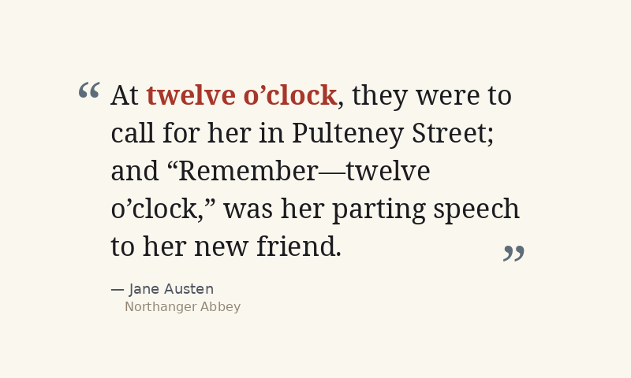

# LitClock

LitClock is a literary clock built from public-domain text. It picks a time-matched quote, renders it as a designed image, and can display it on eInk hardware like the Pimoroni Inky Impression 7.3.



## What it does

- picks a quote for the current fuzzy time bucket
- renders it in a bookish display layout
- can show it on an Inky eInk display
- supports `debug` and cleaner `production` render modes

## Quick start

### Local render test

```bash
python3 run_clock.py --once
```

### Push to Inky

```bash
python3 run_clock.py --display-script display_inky.py
```

### Cleaner appliance-style output

```bash
python3 run_clock.py --display-script display_inky.py --mode production
```

## Raspberry Pi / Inky setup

If Inky is already installed and working on the Pi, the short path is:

```bash
source ~/.virtualenvs/pimoroni/bin/activate
git clone git@github.com:gkoch02/LitClock.git
cd LitClock
python3 run_clock.py --once
python3 display_inky.py output/current.png
python3 run_clock.py --display-script display_inky.py --mode production
```

For full Pi setup and appliance boot instructions, see:

- [pi_setup_inky_impression.md](pi_setup_inky_impression.md)
- [inky_impression_notes.md](inky_impression_notes.md)
- [`litclock.service.example`](litclock.service.example)
- [`bootstrap_pi_inky.sh`](bootstrap_pi_inky.sh)

## Project structure

### Core runtime
- `run_clock.py` - runtime loop, bucket-change refresh behavior, optional display handoff
- `render_quote.py` - quote rendering and layout
- `pick_quote.py` - quote selection from the attributed corpus
- `display_inky.py` - thin Inky display bridge

### Corpus and mining tools
- `gutenberg_time_miner.py`
- `clean_display_quotes.py`
- `quality_filter.py`
- `enrich_metadata.py`
- `merge_candidates.py`
- `bucket_coverage.py`
- `fix_substring_time_matches.py`

For mining/backfill work and corpus expansion notes, see:

- [gutenberg_expansion_plan.md](gutenberg_expansion_plan.md)
- `gutenberg_expansion_batch1.sh`
- `gutenberg_expansion_batch2.sh`
- `run_batch2.sh`

## Notes

- The clock refreshes when the fuzzy bucket changes, not every minute.
- The default picker now uses the attributed dataset: `output/candidates-attributed.jsonl`.
- Production mode hides debug metadata for a cleaner display.
- One bucket currently remains unfilled (`h3_late_past`), so that time falls back to the nearest neighboring bucket rather than leaving the display blank.
