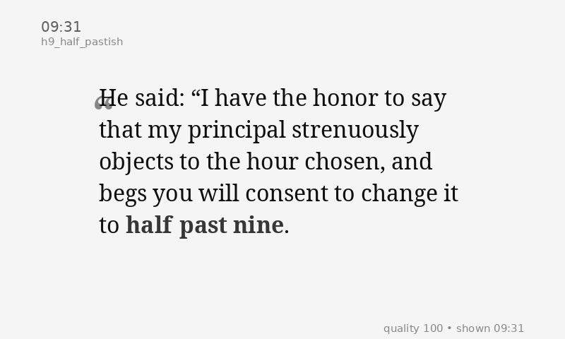

# Author Clock Corpus Miner

First-pass tooling for harvesting time-related quote candidates from Project Gutenberg or local plaintext files.



## What it does

- downloads Gutenberg plaintext books by ebook id
- scans local `.txt` files or directories
- detects exact and fuzzy time phrases
- normalizes hits into fuzzy clock buckets
- writes review output as JSONL or CSV

This is a harvesting tool, not a final editorial system. Expect false positives, duplicates, and occasional weirdness from literary text.

## Quick start

```bash
cd ~/workspace
python3 gutenberg_time_miner.py \
  --gutenberg-id 1342 \
  --gutenberg-id 98 \
  --strict \
  --output output/candidates.jsonl \
  --print-sample 10
```

Example with a local folder of texts:

```bash
python3 gutenberg_time_miner.py \
  --input ~/books/public-domain \
  --format csv \
  --output output/candidates.csv
```

## Output fields

- `source_path`
- `source_id`
- `match_type`
- `matched_text`
- `quote_text`
- `context_text`
- `hour`
- `minute`
- `normalized_time`
- `fuzzy_bucket`
- `daypart_bucket`
- `line_number`
- `match_start`
- `match_end`

## Current fuzzy bucket scheme

Minute ranges map to coarse buckets per hour:

- `exact` → `:00`
- `just_after` → `:01-:05`
- `early_past` → `:06-:14`
- `quarter_pastish` → `:15-:19`
- `half_pastish` → `:20-:39`
- `late_past` → `:40-:44`
- `quarter_toish` → `:45-:49`
- `just_before` → `:50-:59`

Example bucket names:

- `h1_exact`
- `h1_just_after`
- `h7_half_pastish`
- `h11_just_before`

Daypart buckets are inferred separately when possible:

- `dawn`
- `morning`
- `noon`
- `afternoon`
- `dusk`
- `evening`
- `night`
- `midnight`
- `small_hours`

## Merge and dedupe

After multiple harvest runs, merge them like this:

```bash
python3 merge_candidates.py \
  output/raw-candidates-strict.jsonl \
  output/raw-candidates-strict-batch2.jsonl
```

This writes:

- `output/candidates-merged.jsonl`
- `output/candidates-merged-summary.json`

## Bucket coverage

To see which fuzzy-clock buckets are strong or starved:

```bash
python3 bucket_coverage.py \
  output/candidates-merged.jsonl
```

This writes:

- `output/bucket-coverage.json`
- `output/bucket-coverage.md`

## Target sparse buckets

To hunt the emptiest/sparsest buckets with explicit phrase searches against the cached Gutenberg texts:

```bash
python3 target_sparse_buckets.py \
  output/bucket-coverage.json
```

This writes:

- `output/targeted-candidates.jsonl`

## Clean display quotes

To turn raw harvested excerpts into better display-ready quotes:

```bash
python3 clean_display_quotes.py \
  output/candidates-merged-plus-targeted.jsonl
```

This writes:

- `output/candidates-cleaned.jsonl`

Each row gets:

- `display_quote`
- `display_fragment`
- `cleanup_status`

## Quality scoring

To add lightweight quality heuristics before picking quotes:

```bash
python3 quality_filter.py \
  output/candidates-cleaned.jsonl
```

This writes:

- `output/candidates-quality.jsonl`

## Pick a quote

To demo what the clock would show for a given time:

```bash
python3 pick_quote.py --time 22:54
```

Or for a specific bucket:

```bash
python3 pick_quote.py --bucket h10_just_before
```

## Enrich attribution metadata

To add author/title metadata from cached Gutenberg headers:

```bash
python3 enrich_metadata.py \
  output/candidates-quality.jsonl
```

This writes:

- `output/candidates-attributed.jsonl`

## Render a display image

To render a PNG prototype for a given time:

```bash
python3 render_quote.py \
  --time 22:54 \
  --picker pick_quote.py
```

This writes a PNG like:

- `output/render-2254.png`

## Run the clock loop

To run it like a simple appliance that always rewrites the current display image:

```bash
python3 run_clock.py --once
```

Or continuously:

```bash
python3 run_clock.py
```

This keeps refreshing:

- `output/current.png`

In continuous mode, the clock now rerenders only when the **fuzzy bucket changes**, not every minute. That means it updates when the displayed literary time meaning changes.

To also push the image to an Inky display each refresh:

```bash
python3 run_clock.py \
  --display-script display_inky.py
```

## Inky Impression 7.3 Spectra 6

Notes for the target testing display are in:

- `inky_impression_notes.md`
- `pi_setup_inky_impression.md`

If Inky is **already installed and working** on the Pi, the shortest path is:

```bash
source ~/.virtualenvs/pimoroni/bin/activate
git clone git@github.com:gkoch02/LitClock.git
cd LitClock
python3 run_clock.py --once
python3 display_inky.py output/current.png
python3 run_clock.py --display-script display_inky.py
```

Bootstrap script for a fresh Pi:

```bash
bash bootstrap_pi_inky.sh
```

To display an already-rendered image on Inky:

```bash
python3 display_inky.py \
  output/current.png
```

## Notes

- Gutenberg downloads are cached in `data/gutenberg/` by default.
- Use `--strict` to exclude generic daypart-only matches like bare `night` or `morning`, and to suppress noisy digital patterns that often capture verse-style citations.
- You can also exclude specific pattern classes manually with `--exclude-match-type daypart`.
- The script currently prefers speed and usefulness over perfect NLP.
- Next obvious step: a tiny review UI to approve/reject/dedupe candidates.
