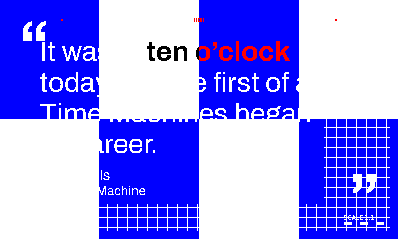

# `blueprint` (retired)

Retired from the rotation, the renderer and the live docs. Everything the theme was is kept in this folder so it can be restored as it was; see [`../../README.md`](../../README.md) for how.

## README row

| `blueprint`   |      | blue/white  | white | red    | Archivo (sans)       | Cyanotype drafting sheet      |

## Design notes (from `docs/themes.md`)

  - `blueprint` (white/blue/red, Archivo geometric sans) — drafting aesthetic.

    **Accent.** The matched-phrase red accent is rerouted in `_draw_text_body` to a 50/50 R+K maroon stipple (shared seam with `scholar`), reading as a darker red pencil pressed firmly into the cyanotype drafting paper.

    **Border.** `draw_blueprint_border` draws a thin blue outer rectangle with red crosshair "registration marks" centred on each corner, echoing the print-alignment ticks used on engineering drawings, and a thin blue graph-paper grid inside the frame at 20px spacing so the ground reads as engineering paper rather than an empty sheet — text is painted on top so the grid only shows through between glyphs.

    **Drafting callouts.** A top-margin **overall-width dimension line** (extension ticks + a centre-broken rule carrying the width figure, with inward red arrowheads — the canonical "overall width" annotation, rule in white drafting ink and arrowheads/figure in the red registration ink) and a bottom-right graduated **"SCALE 1:1" legend bar** (five alternating filled/outline white cells). Both sit in the clear margins — the dimension line at y=40, below the y=14-29 debug-banner band; the scale bar tucked into the BR corner clear of the bottom-left attribution — so no `_DEBUG_LABEL_RIGHT_INSET` change is needed.

## Font notes (from `docs/themes.md`)

  - `blueprint` uses **Archivo** (grotesque sans — the first pure-sans silhouette in the rotation; ships static Regular + Bold TTFs).

## Registration

- `THEME_ORDER`: sat after `nightvision`.
- `display_inky.THEME_SATURATION`: `"blueprint": 0.7,`

### `THEMES` entry (`render_quote/theme_tables.py`)

```python
    # Cyanotype blueprint. Blue paper, white ink for body, frame and grid,
    # with the registration crosshairs and matched phrase in red — the
    # drafter's red-pencil callout. ``draw_blueprint_border``'s Layer 0 paints
    # a 50/50 white/blue checkerboard so the ground reads as a paler cyanotype
    # wash. Inverted polarity plus Archivo keep it distinct from ``scholar``.
    "blueprint": {
        "page_bg": SPECTRA6["blue"],
        "text": SPECTRA6["white"],
        "subtle": SPECTRA6["white"],
        "faint": SPECTRA6["white"],
        "accent": SPECTRA6["red"],
        # Both ornament keys white: the quote marks render solid white rather
        # than dithered (same trick as ``gothic`` / ``illuminated``).
        "ornament_dark": SPECTRA6["white"],
        "ornament_light": SPECTRA6["white"],
        "source": SPECTRA6["white"],
    },
```

### `THEME_FONTS` entry (`render_quote/theme_tables.py`)

```python
    "blueprint": {
        # Archivo grotesque; falls back through common Linux/Pi sans installs
        # before the Playfair chain.
        "quote_regular": [
            ARCHIVO_REGULAR,
            "/usr/share/fonts/truetype/dejavu/DejaVuSans.ttf",
            "/usr/share/fonts/truetype/liberation/LiberationSans-Regular.ttf",
            "/usr/share/fonts/truetype/liberation2/LiberationSans-Regular.ttf",
            "/usr/share/fonts/truetype/noto/NotoSans-Regular.ttf",
            *QUOTE_FONT_SEMIBOLD_CANDIDATES,
        ],
        "quote_bold": [
            ARCHIVO_BOLD,
            "/usr/share/fonts/truetype/dejavu/DejaVuSans-Bold.ttf",
            "/usr/share/fonts/truetype/liberation/LiberationSans-Bold.ttf",
            "/usr/share/fonts/truetype/liberation2/LiberationSans-Bold.ttf",
            "/usr/share/fonts/truetype/noto/NotoSans-Bold.ttf",
            *QUOTE_FONT_BOLD_CANDIDATES,
        ],
        "ornament": [
            ARCHIVO_BOLD,
            "/usr/share/fonts/truetype/dejavu/DejaVuSans-Bold.ttf",
            "/usr/share/fonts/truetype/liberation/LiberationSans-Bold.ttf",
            "/usr/share/fonts/truetype/liberation2/LiberationSans-Bold.ttf",
            "/usr/share/fonts/truetype/noto/NotoSans-Bold.ttf",
            *ORNAMENT_FONT_CANDIDATES,
        ],
    },
```

### `_draw_text_body` branch (`render_quote/text.py`)

The colour reroute this theme had in `_draw_text_body`; a branch shared with another retired theme is shown whole.

```python
    elif theme in ("blueprint", "scholar") and fill == SPECTRA6["red"]:
        # Maroon (R+K 1:1): blueprint's red pencil pressed hard, scholar's
        # aged red-lead annotation. Border marks stay solid red.
        draw_text_dithered(image, xy, text, font, dark=fill, light=SPECTRA6["black"])
    elif theme == "illuminated" and fill == SPECTRA6["blue"]:
        # Violet (R+B 1:1) — Tyrian purple, in the same register as the
        # border's R+B+K plum cabochons. The red body never hits this branch.
        draw_text_dithered(image, xy, text, font, dark=SPECTRA6["red"], light=SPECTRA6["blue"])
    elif theme == "glacier" and fill == SPECTRA6["green"]:
        # Teal (G+B 5/8:3/8, Bayer threshold 6/16). 50/50 cyan read too close
        # to the blue body and solid green read muddy; the green bias pulls
        # the phrase off the body while staying cool. Plus a
        # ``stroke_width=1`` faux bold, since Iceland ships only Regular and
        # hue alone doesn't carry the differentiation.
        draw_text_dithered(image, xy, text, font, dark=fill, light=SPECTRA6["blue"], light_density=0.375, stroke_width=_bold_stroke_for_theme(theme))
    elif theme == "risograph" and fill == SPECTRA6["blue"]:
        # Violet (R+B 1:1) — the riso red-over-blue overprint. Keeps the
        # theme's no-black invariant by construction.
        draw_text_dithered(image, xy, text, font, dark=SPECTRA6["red"], light=fill)
```
