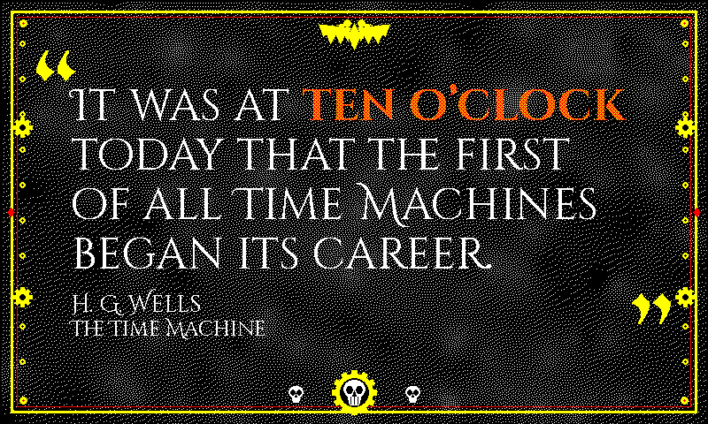

# `grimdark` (retired)

Retired from the rotation, the renderer and the live docs. Everything the theme was is kept in this folder so it can be restored as it was; see [`../../README.md`](../../README.md) for how.

## README row

| `grimdark`    |        | black       | white | forge-amber | Cinzel Decorative + UnifrakturMaguntia | Warhammer 40K Imperial Gothic |

## Design notes (from `docs/themes.md`)

  - `grimdark` (black void ground / bone-white Cinzel Decorative body / forge-amber matched-phrase / gold Imperial trim) — **Warhammer-40K-esque Imperial Gothic**, "in the grim darkness of the far future." A literary-layout theme (not a custom-render frame) with a heavy `draw_grimdark_border` decoration in the militaristic-cathedral / gothic-industrial register of the 40K Imperium.

    **Matched phrase.** The red accent is rerouted in `_draw_text_body` to **forge-amber** (R+Y 5/8:3/8 tangerine via the shared 4×4 Bayer threshold — the documented `deco` / `atomic` / `astrarium` recipe), so the time glows like molten metal / a hazard stripe against the black bulkhead, tying it to the gold Imperial trim. A 50/50 R+Y would read as washed-out amber because yellow out-luminates red; the 3/8 yellow bias drags the perceived hue back onto the warm forge-orange.

    **Quote marks.** The oversized opening/closing marks render in **gold** blackletter — both `ornament` THEMES slots pin to yellow so `draw_faux_gray_text` collapses to solid gilt (the trick `gothic` uses with red; on the black ground a white `ornament_light` half would wash the gilt to grey).

    **Drawing rule.** `draw_grimdark_border` lays the rest of the vocabulary on top using solid Spectra-6 inks via ImageDraw primitives only, so it clips silently at `/api/preview` thumbnail sizes rather than indexing a raw `PixelAccess` past the canvas.

    **Gunmetal plate (Layer 0).** A committed continuous-tone weathered-metal PNG — [`assets/grimdark_gunmetal.png`](assets/grimdark_gunmetal.png), produced by [`scripts/generate_grimdark_plate.py`](scripts/generate_grimdark_plate.py): a dark charcoal vignette + seeded oxidation blotches that lighten (scuffed/oxidised plate) or darken (grime/shadow) + faint diagonal scratches. It is Floyd–Steinberg-dithered at render time to the **white+black** sub-palette via `_load_dithered_plate`, so the bulkhead breaks into an organic white-on-black stipple whose local density tracks the metal's tone — the K+W inverse of the cream Y+W washes other themes paint on white grounds, and the second consumer of the render-time image-dithering capability `anna_atkins` introduced. Spectra 6 has no grey ink, so the dither *is* how gunmetal exists on the panel. It is painted first so the trim / ornaments / quote text all land on top. If the asset is missing, `_grimdark_paint_mottle` synthesises the equivalent — sparse ~4.5% organic white hash-scatter (NOT an ordered Bayer grid, which would read as a regular dot-screen) + seeded lighten/darken blotches — as a deterministic graceful fallback.

    **Trim.** A **doubled imperial trim** (thick gold outer rule + thin blood-red inner rule, the polychrome banded frame of an ornate reliquary / starship bulkhead hatch — distinct from `gothic`'s red+white doubled rule and `illuminated`'s single-ink doubled rule), with **corner rivets** (gold hex-bolt discs with a blood centre at the four inner corners — armour-plate fastenings) and **mid-edge studs** (small blood diamonds riveted onto the gold side rules).

    **Iconography.** A gold **Imperial Aquila** (the double-headed eagle, the single most recognisable Imperium device — a torso diamond, twin outward-facing beaked heads, and two swept wings whose serrated lower edge reads as splayed flight feathers) is centred in the top margin. A **Mechanicus cog-skull** (a bone-white skull set inside a gold toothed gear ring — the icon of the Adeptus Mechanicus machine-priesthood — flanked by two smaller ossuary skulls) is centred in the bottom margin via the `_grimdark_cog` / `_grimdark_skull` helpers. **Riveted bulkhead seams** — a vertical column of small gold rivets down each side rail with two embedded Mechanicus cog nodes per side, the servitor / machine-corridor texture — sit in the narrow x≈25 side band, well clear of the centred quote column.

    **Debug band.** The Aquila is centred horizontally (clear of the right-aligned `DEBUG MODE` banner) and the trim's right rule leaves ~7 px of clearance (as `newsprint` does), so `grimdark` is intentionally absent from `_DEBUG_LABEL_RIGHT_INSET` — same exemption as `atomic` / `dispatch`.

    **Distinctness.** Visually distinct from the rotation's two other black/white/red themes: `gothic` is an EB-Garamond body + Unifraktur matched phrase under a cathedral-tracery border, and `roman` is Cinzel-everywhere on a white ground with no blackletter — neither shares grimdark's Cinzel-body + Unifraktur-ornament + Aquila/skull/rivet silhouette. Saturation tier `0.7` (dark non-white ground).

## Font notes (from `docs/themes.md`)

  - `grimdark` pairs **Cinzel Decorative** (the chiselled capitalis-monumentalis revival `roman` uses for its body) for the bone-white quote body and matched phrase with **UnifrakturMaguntia** (the blackletter ornament face `illuminated` / `gothic` use) for the oversized gold quote marks — the Roman-capitals + Gothic-blackletter blend that *is* Imperial Gothic typography.

    The body steps up one Cinzel weight (Regular → Bold) for the matched phrase and earns its differentiation from the forge-amber accent reroute rather than switching face mid-line (switching would shatter the inscription illusion, same as `roman`). Each chain ends at a heavy serif (DejaVu / Liberation / Noto Serif Bold) before the Playfair chain so a missing-Cinzel install lands on a high-contrast serif rather than a sans. The pairing keeps grimdark visually distinct from both sources: `roman` is Cinzel-everywhere with no blackletter, and `gothic` is an EB-Garamond body with a Unifraktur matched phrase.

## Registration

- `THEME_ORDER`: sat after `letter`.
- `display_inky.THEME_SATURATION`: `"grimdark": 0.7,`

### `THEMES` entry (`render_quote/theme_tables.py`)

```python
    # Grimdark / Imperial Gothic. Black void, bone-white body, red accent
    # rerouted to R+Y 5:3 forge-amber on the matched phrase.
    # ``draw_grimdark_border`` adds a doubled gold + blood trim, an Aquila in
    # the top margin, a skull in the bottom margin, rivets and studs. Both
    # ornament slots gold so the blackletter quote marks paint solid gilt (a
    # white half would wash it grey on black — cf. ``gothic``).
    "grimdark": {
        "page_bg": SPECTRA6["black"],
        "text": SPECTRA6["white"],
        "subtle": SPECTRA6["white"],
        "faint": SPECTRA6["white"],
        "accent": SPECTRA6["red"],
        "ornament_dark": SPECTRA6["yellow"],
        "ornament_light": SPECTRA6["yellow"],
        "source": SPECTRA6["white"],
    },
```

### `THEME_FONTS` entry (`render_quote/theme_tables.py`)

```python
    "grimdark": {
        # Imperial Gothic = Roman + blackletter. Cinzel Decorative body (the
        # stone-cut inscription register) with UnifrakturMaguntia quote marks
        # — a pairing neither ``roman`` nor ``gothic`` uses. The matched phrase
        # steps one Cinzel weight up (Regular → Bold) and is told apart by the
        # forge-amber reroute in ``_draw_text_body``; switching face mid-line
        # would break the inscription. Heavy-serif fallbacks before Playfair.
        "quote_regular": [
            CINZELDECORATIVE_REGULAR,
            "/usr/share/fonts/truetype/dejavu/DejaVuSerif-Bold.ttf",
            "/usr/share/fonts/truetype/liberation2/LiberationSerif-Bold.ttf",
            "/usr/share/fonts/truetype/noto/NotoSerif-Bold.ttf",
            *QUOTE_FONT_SEMIBOLD_CANDIDATES,
        ],
        "quote_bold": [
            CINZELDECORATIVE_BOLD,
            CINZELDECORATIVE_BLACK,
            "/usr/share/fonts/truetype/dejavu/DejaVuSerif-Bold.ttf",
            "/usr/share/fonts/truetype/liberation2/LiberationSerif-Bold.ttf",
            *QUOTE_FONT_BOLD_CANDIDATES,
        ],
        "ornament": [
            UNIFRAKTUR_BOOK,
            CINZELDECORATIVE_BLACK,
            *ORNAMENT_FONT_CANDIDATES,
        ],
    },
```

### `_draw_text_body` branch (`render_quote/text.py`)

The colour reroute this theme had in `_draw_text_body`; a branch shared with another retired theme is shown whole.

```python
    elif theme == "grimdark" and fill == SPECTRA6["red"]:
        # Forge amber (R+Y 5/8:3/8 on BAYER_4x4, as ``deco``): molten metal on
        # the bulkhead, tied to the gold trim. 50/50 would read washed-out
        # because yellow out-luminates red.
        draw_text_dithered(image, xy, text, font, dark=fill, light=SPECTRA6["yellow"], light_density=0.375)
```
