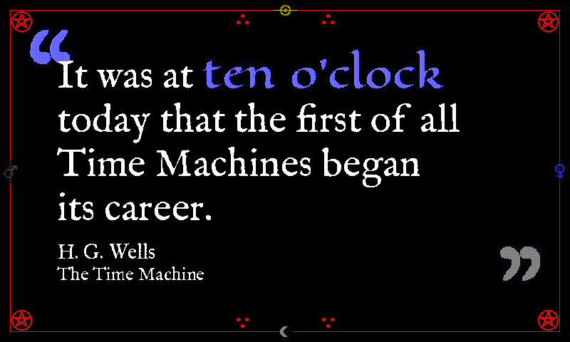

# `grimoire` (retired)

Retired from the rotation, the renderer and the live docs. Everything the theme was is kept in this folder so it can be restored as it was; see [`../../README.md`](../../README.md) for how.

## README row

| `grimoire`    |        | black       | white | sky-blue | IM Fell English + Eagle Lake   | Faustian spellbook       |

## Design notes (from `docs/themes.md`)

  - `grimoire` (black/white/red+blue, IM Fell English body + Eagle Lake matched phrase) — alchemical grimoire / Faustian spellbook, the black leather-bound midnight counterpoint to `alchemy`'s yellow daylight ritual diagram. Shares only the palette family with `alchemy`.

    **Matched-phrase face.** Eagle Lake (Brian J. Bonislawsky / Astigmatic, OFL) is an ornate calligraphic display face whose thorny, spiked ascenders read as an arcane hand against the dignified vintage-press body — short time strings ("half past two") render in its phantom-scrawl silhouette glowing through the page like a magic-circle inscription. It is deliberately neither `gothic`'s Unifraktur textura nor `alchemy`'s MedievalSharp broad-nib hand.

    **Matched-phrase ink.** A **50/50 blue/white sky-blue stipple** (B+W 1:1), the same recipe the oversized quote marks use via `draw_faux_gray_text` (`ornament_dark` blue + `ornament_light` white), so phrase and ornaments read as one cool moon-silver register against the black ground — the documented sky-blue `glacier`'s corner shards use, here carrying both the ornament scale and the body scale. The red `accent` slot is a **sentinel, never painted**: the phrase contributes no red, keeping it clear of the border's pentagrams, rules and sigils, which own the red on this plate (the `gothic` reasoning reached by a different route). `_draw_text_body` therefore passes `dark=blue` explicitly rather than `dark=fill`, the same sentinel shape `anna_atkins` uses for its yellow accent. `tests/test_render_quote_themes.py::TestGrimoireMatchedPhrase` pins the 1:1 ratio, the no-red rule, and — by reading the recipe out of `THEMES` rather than restating it — that the phrase and the ornament marks cannot drift apart.

    **Border.** `draw_grimoire_border` draws inscribed pentagrams at the four canvas corners and the four classical planetary alchemical sigils on the mid-edges — ☉ Sun (top, tangerine R+Y), ☽ Moon (bottom, sky-blue B+W), ♂ Mars (left, maroon R+K), ♀ Venus (right, purple R+B). **Tria-prima triad dots** (the three-dot `∴` ritual-notation mark — salt · sulfur · mercury) in solid rubric red flank the Sun and Moon sigils, filling the otherwise-empty top / bottom interior bands between the corner pentagrams and the centre sigils. Iconographically unrelated to `gothic`'s blackletter + cathedral-tracery vocabulary despite the shared black/white/red palette shape — Eagle Lake's arcane hand plus *inscribed* pentagrams and planetary sigils give grimoire its own ritual-scrawl signature.

    **Tried and rejected.** The matched-phrase seam has moved twice; don't repeat either failure.
    - **The "candlelit" 3/4-red mix.** Read as *dim* rather than warm at panel distance on the black ground. B+W is half *white* rather than three-quarters red, so it sits far brighter, and is already proven at ornament scale on this exact ground.
    - **Solid white.** Cured the dimness but left the phrase as the only untinted text on a plate where the border and the quote marks are all coloured, so it stopped reading as a highlight at all, with only face and weight distinguishing it from the body.
    - **TFoustScript** (the earlier matched-phrase face). It carried no licence — its name table declared `© 2025 myfont All rights reserved` with no grant — so Eagle Lake replaced it.

## Font notes (from `docs/themes.md`)

  - `grimoire` shares `alchemy`'s **IM Fell English** body but routes the matched phrase through **Eagle Lake** (Brian J. Bonislawsky / Astigmatic, OFL) — a single-weight ornate calligraphic display face whose thorny, spiked ascenders read as occult phantom-scrawl, and which comes from the same foundry as seven other faces in the bundle.

    **The `card_quote_bold` seam.** Eagle Lake replaced TFoustScript, a face carrying no redistribution grant. Eagle Lake's 404-glyph cmap (against TFoust's ASCII-only 95) retired grimoire's `card_quote_bold` override: the seam existed only because PIL's font fallback is file-level rather than glyph-level, so an ASCII-only face tofu'd the em-dash and curly quotes `render_source_card` emits. The seam itself remains in `theme_font_candidates` — the hazard is a property of PIL, not of that font — but no theme uses it today.

## Registration

- `THEME_ORDER`: sat after `alchemy`.
- `display_inky.THEME_SATURATION`: `"grimoire": 0.7,`
- Was in _THEMES_RIGID_MATCH_SPACING with gothic (its Eagle Lake phrase read as disconnected syllables when stretched).

### `THEMES` entry (`render_quote/theme_tables.py`)

```python
    # Faustian spellbook. Black leather ground, white IM Fell English body,
    # Eagle Lake matched phrase; the red accent is a sentinel that
    # ``_draw_text_body`` paints as B+W sky blue, matching the quote marks.
    # Same palette shape as ``gothic`` but different iconography: inscribed
    # pentagrams and the planetary sigils on the mid-edges (Sun ☉ top, Moon ☽
    # bottom, Mars ♂ left, Venus ♀ right). ``alchemy`` is the daytime
    # parchment counterpart.
    "grimoire": {
        "page_bg": SPECTRA6["black"],
        "text": SPECTRA6["white"],
        "subtle": SPECTRA6["white"],
        "faint": SPECTRA6["white"],
        "accent": SPECTRA6["red"],
        # Quote marks render as a 50/50 blue/white checkerboard
        # (``draw_faux_gray_text``) — the "sky" mix: a cool moon-silver
        # counterpoint to the warm red iconography.
        "ornament_dark": SPECTRA6["blue"],
        "ornament_light": SPECTRA6["white"],
        "source": SPECTRA6["white"],
    },
```

### `THEME_FONTS` entry (`render_quote/theme_tables.py`)

```python
    "grimoire": {
        # IM Fell English body, shared with ``alchemy``; the two differ by
        # ground and matched-phrase face. EB Garamond Regular is the second
        # rank. Eagle Lake carries the matched phrase — the spiked "phantom
        # scrawl" that defines the theme — with EB Garamond Bold behind it
        # only as a missing-file fallback (Eagle Lake has the curly quotes and
        # em-dash). The ornament stays IM Fell so the quote marks match the
        # body's vintage-press character.
        "quote_regular": [
            IMFELLENGLISH_REGULAR,
            EBGARAMOND_REGULAR,
            *QUOTE_FONT_SEMIBOLD_CANDIDATES,
        ],
        "quote_bold": [
            EAGLELAKE_REGULAR,
            EBGARAMOND_BOLD,
            *QUOTE_FONT_BOLD_CANDIDATES,
        ],
        "ornament": [
            IMFELLENGLISH_REGULAR,
            EBGARAMOND_BOLD,
            *ORNAMENT_FONT_CANDIDATES,
        ],
    },
```

### `_draw_text_body` branch (`render_quote/text.py`)

The colour reroute this theme had in `_draw_text_body`; a branch shared with another retired theme is shown whole.

```python
    elif theme == "grimoire" and fill == SPECTRA6["red"]:
        # Sky blue (B+W 1:1), the recipe this theme's quote marks use, so the
        # phrase and ornaments share one moon-silver register. The red
        # ``accent`` is a sentinel and is never painted — hence ``dark=blue``
        # rather than ``dark=fill`` — which keeps the phrase clear of the
        # border's red pentagrams and sigils. (Solid white left it
        # undifferentiated from the body; a 3/4-red mix read dim.)
        draw_text_dithered(image, xy, text, font, dark=SPECTRA6["blue"], light=SPECTRA6["white"])
```
