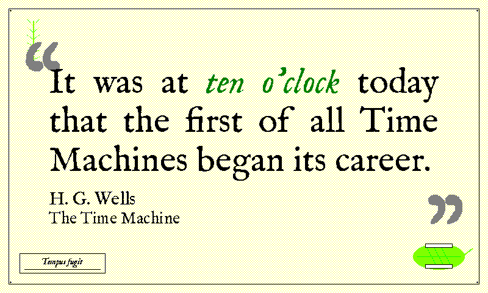

# `herbarium` (retired)

Retired from the rotation, the renderer and the live docs. Everything the theme was is kept in this folder so it can be restored as it was; see [`../../README.md`](../../README.md) for how.

## README row

| `herbarium`   |      | cream/white | black | green  | IM Fell English (italic) | Pressed-plant specimen sheet |

## Design notes (from `docs/themes.md`)

  - `herbarium` (white/cream/black/forest-green, IM Fell English italic) — a 19th-century pressed-plant specimen sheet, and the first theme whose defining colour story is the green axis; every other green-touching theme (`nightvision` / `glacier` / `roman`) uses green as a secondary accent against a different body colour.

    **Accent.** The matched-phrase green accent is rerouted in `_draw_text_body` to a 50/50 G+K stipple — forest green, the documented dark-green recipe from `spectra6_color_recipes.md`'s "not in use / forward reference" section that herbarium now claims — reading as the dark-pressed plant material a real archival specimen develops.

    **Sheet.** `draw_herbarium_border` paints a cream Layer-0 wash (Y@12.5% Bayer, the recipe `illuminated` / `dispatch` use), a thin black engraver's hairline rule at inset 14, and four small "pinhole" dots at the inner corners (where the specimen would be pinned to the mounting sheet).

    **Specimens.** A stylised pressed-leaf silhouette in the bottom-right corner is painted in yellow as a sentinel ink and bbox-post-passed to flip half to green per `(x+y)&1` parity → olive (Y+G 1:1, the recipe `roman`'s laurel sprigs use), with darker olive midrib and side veins; two off-white **gummed mounting-tape strips** pin its midrib to the sheet (the linen hinges that hold a real specimen flat). A **second smaller pressed-fern specimen** in the top-left margin (olive stem + tapering leaflets via the same Y+G sentinel-then-post-pass recipe) counterweights it diagonally, and a "Tempus fugit" specimen cartouche in the bottom-left carries a single writing rule so the box reads as a real specimen label.

    **Debug band.** The TR pinhole at (width-18, 17) sits inside the y=14-29 banner band horizontally adjacent to the default label edge, so `herbarium` carries an entry of 24 in `_DEBUG_LABEL_RIGHT_INSET` for a 4 px breathing gap.

## Font notes (from `docs/themes.md`)

  - `herbarium` reuses the bundled **IM Fell English** chain that `alchemy` / `grimoire` already pull from — the 17th-century Oxford-press silhouette reads as scientific-historical against the cream-washed page. The matched-phrase slot picks IM Fell *Italic* rather than a heavier weight: italic is the canonical convention for Latin scientific names on a real herbarium specimen sheet, and the olive-stippled colour accent (via `_draw_text_body`) carries the visual differentiation a true bold would otherwise provide.

## Registration

- `THEME_ORDER`: sat after `scholar`.
- `display_inky.THEME_SATURATION`: `"herbarium": 0.5,`

### `THEMES` entry (`render_quote/theme_tables.py`)

```python
    # Herbarium specimen sheet. Cream Y+W Layer 0, black IM Fell English
    # body, matched phrase rerouted in ``_draw_text_body`` to forest green
    # (G+K 1:1) — an olive (Y+G) accent would sink into the cream ground.
    # The border adds an olive pressed leaf bottom-right and a "Tempus fugit"
    # cartouche bottom-left: the theme's colour story is the green axis.
    "herbarium": {
        "page_bg": SPECTRA6["white"],
        "text": SPECTRA6["black"],
        "subtle": SPECTRA6["black"],
        "faint": SPECTRA6["black"],
        # Green sentinel, rerouted by ``_draw_text_body`` to G+K forest green.
        # The leaf uses a separate Y+G olive so text and decoration land on
        # related but distinct greens.
        "accent": SPECTRA6["green"],
        "ornament_dark": SPECTRA6["black"],
        "ornament_light": SPECTRA6["white"],
        "source": SPECTRA6["black"],
    },
```

### `THEME_FONTS` entry (`render_quote/theme_tables.py`)

```python
    "herbarium": {
        # IM Fell English (shared with ``alchemy`` / ``grimoire``). The
        # matched phrase is IM Fell *Italic* rather than a heavier weight —
        # italic is the convention for Latin names on a specimen sheet — and
        # the forest-green accent (``_draw_text_body``) carries the rest. The
        # Regular fallback keeps a missing italic off the bitmap fallback.
        "quote_regular": [
            IMFELLENGLISH_REGULAR,
            *QUOTE_FONT_SEMIBOLD_CANDIDATES,
        ],
        "quote_bold": [
            IMFELLENGLISH_ITALIC,
            IMFELLENGLISH_REGULAR,
            "/usr/share/fonts/truetype/dejavu/DejaVuSerif-Italic.ttf",
            "/usr/share/fonts/truetype/liberation/LiberationSerif-Italic.ttf",
            *QUOTE_FONT_BOLD_CANDIDATES,
        ],
        "ornament": [
            IMFELLENGLISH_REGULAR,
            *ORNAMENT_FONT_CANDIDATES,
        ],
    },
```

### `_draw_text_body` branch (`render_quote/text.py`)

The colour reroute this theme had in `_draw_text_body`; a branch shared with another retired theme is shown whole.

```python
    elif theme == "herbarium" and fill == SPECTRA6["green"]:
        # Forest green (G+K 1:1, the recipes doc's dark green): pressed plant
        # material against the cream ground, distinct from the border's Y+G
        # olive leaf.
        draw_text_dithered(image, xy, text, font, dark=fill, light=SPECTRA6["black"])
```
