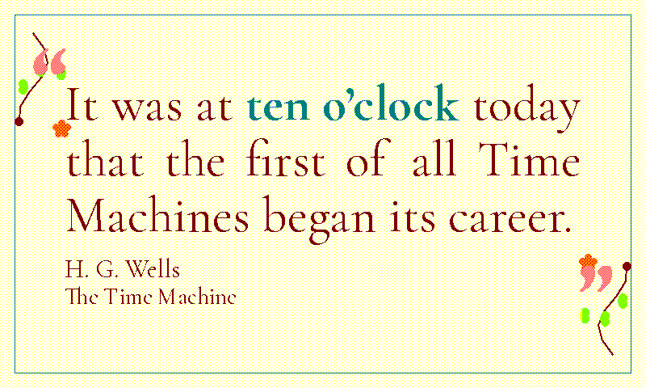

# `mucha` (retired)

Retired from the rotation, the renderer and the live docs. Everything the theme was is kept in this folder so it can be restored as it was; see [`../../README.md`](../../README.md) for how.

## README row

| `mucha`       |              | cream/white | maroon | teal  | Cormorant Garamond + Berkshire Swash | Art Nouveau (Mucha vines)  |

## Design notes (from `docs/themes.md`)

  - `mucha` (cream-washed white / maroon body / cyan matched phrase, Cormorant Garamond + Berkshire Swash ornament) — Art Nouveau / Belle-Époque poster, and the first theme to use a synthesised colour as its primary body fill rather than just an accent.

    **Body and accent.** The `text` THEMES slot holds the red sentinel ink that `_draw_text_body` routes through a 50/50 R+K stipple → maroon (R+K 1:1, the documented recipe `dispatch` / `gothic` / `chanbara` / `grimoire` / `blueprint` / `scholar` use for their matched phrases, here promoted to the body), reading as the deep wine / oxblood the period's poster lettering actually used. The matched phrase shifts to cyan (G+B 1:1, the `glacier` recipe) for cool-vs-warm contrast.

    **Border.** `draw_mucha_border` is the rotation's first all-curve / organic border: a cream Layer-0 wash (the Y+W recipe of `illuminated` / `dispatch` / `herbarium`) and a thin teal rule at inset 18, painted in green as a sentinel ink and perimeter-post-passed to flip half to blue per `(x+y)&1` parity → cyan, tying the rule to the matched-phrase colour story.

    **Vines.** S-shaped organic vine ornaments at the top-left and bottom-right corners. Each vine is a 7-point polyline-approximated Bézier S-curve (PIL doesn't ship curves; the same n-point polygon trick `atomic`'s atom orbits use) with three trefoil leaf clusters painted in yellow as an olive sentinel (Y+G, as the `herbarium` leaf) and a small berry at each stem tip painted in red and bbox-post-passed through `BAYER_4x4 < 6/16` → tangerine (R+Y 5/8:3/8, the `deco` / `atomic` recipe). Each vine tip also carries a **five-petal blossom** — five small petal discs radiating from the tip in the same red sentinel, swept up by the same tangerine post-pass — so the flowering terminal reads as a warm blossom against the cream ground.

    **Asymmetry.** Only the TL/BR corners are ornamented; the top-right and bottom-left are deliberately *unornamented*. Mucha posters compose asymmetrically around an off-centre figure, and reproducing that asymmetry is the visual signature; mucha is intentionally absent from `_DEBUG_LABEL_RIGHT_INSET` for the same reason.

## Font notes (from `docs/themes.md`)

  - `mucha` pairs **Cormorant Garamond** (Christian Thalmann, OFL — high-contrast humanist serif from the dramatic / poster-display branch of the Garamond family, sharper curves than EB Garamond or IM Fell English) for the body with **Berkshire Swash** (Astigmatic, OFL — flourished Belle-Époque script) for the ornament slot so the oversized curly quotes land on a period-display face. Same "humanist body + period display ornament" pairing pattern `illuminated` uses with EB Garamond + UnifrakturMaguntia.

## Registration

- `THEME_ORDER`: sat after `glacier`.
- `display_inky.THEME_SATURATION`: `"mucha": 0.5,`

### `THEMES` entry (`render_quote/theme_tables.py`)

```python
    # Art Nouveau poster (Mucha). Cream Layer 0 on white; the body is maroon
    # (R+K 1:1) via a ``_draw_text_body`` reroute — the first theme with a
    # synthesised body colour — and the matched phrase cyan (G+B 1:1).
    # Border: Bézier S-vines top-left and bottom-right with olive trefoil
    # leaves and a tangerine berry at each tip.
    "mucha": {
        # Body is the red sentinel; ``_draw_text_body`` stipples it R+K to
        # maroon. THEMES values must be native inks
        # (``test_theme_colors_stay_within_spectra6_palette``).
        "page_bg": SPECTRA6["white"],
        "text": SPECTRA6["red"],
        "subtle": SPECTRA6["red"],
        "faint": SPECTRA6["red"],
        # Green sentinel, rerouted G+B to cyan for the matched phrase.
        "accent": SPECTRA6["green"],
        "ornament_dark": SPECTRA6["red"],
        "ornament_light": SPECTRA6["white"],
        "source": SPECTRA6["red"],
    },
```

### `THEME_FONTS` entry (`render_quote/theme_tables.py`)

```python
    "mucha": {
        # Cormorant Garamond — high-contrast humanist serif in the Art Nouveau
        # poster register. Variable, Regular / Bold pinned. Berkshire Swash
        # takes the ornament slot (the ``illuminated`` body + period-ornament
        # pairing); a missing Swash falls through to Cormorant Bold.
        "quote_regular": [
            (CORMORANT_VARIABLE, "Regular"),
            EBGARAMOND_REGULAR,
            *QUOTE_FONT_SEMIBOLD_CANDIDATES,
        ],
        "quote_bold": [
            (CORMORANT_VARIABLE, "Bold"),
            EBGARAMOND_BOLD,
            *QUOTE_FONT_BOLD_CANDIDATES,
        ],
        "ornament": [
            BERKSHIRE_SWASH_REGULAR,
            (CORMORANT_VARIABLE, "Bold"),
            EBGARAMOND_BOLD,
            *ORNAMENT_FONT_CANDIDATES,
        ],
    },
```

### `_draw_text_body` branch (`render_quote/text.py`)

The colour reroute this theme had in `_draw_text_body`; a branch shared with another retired theme is shown whole.

```python
    elif theme in ("mucha", "fillmore") and fill == SPECTRA6["red"]:
        # Maroon (R+K 1:1). Both themes keep the red sentinel in ``text`` so
        # every body path hits this seam:
        #
        # * ``mucha`` — a synthesised body colour, the oxblood of period
        #   poster lettering; its green phrase lands on cyan below.
        # * ``fillmore`` — tames the fatiguing red-on-yellow body, as red ink
        #   darkened on yellow stock. The blue phrase and blob primaries stay
        #   solid, so all six inks still appear.
        draw_text_dithered(image, xy, text, font, dark=fill, light=SPECTRA6["black"])
    elif theme == "mucha" and fill == SPECTRA6["green"]:
        # Cyan (G+B 1:1): a cool accent against the warm maroon body.
        draw_text_dithered(image, xy, text, font, dark=fill, light=SPECTRA6["blue"])
```
