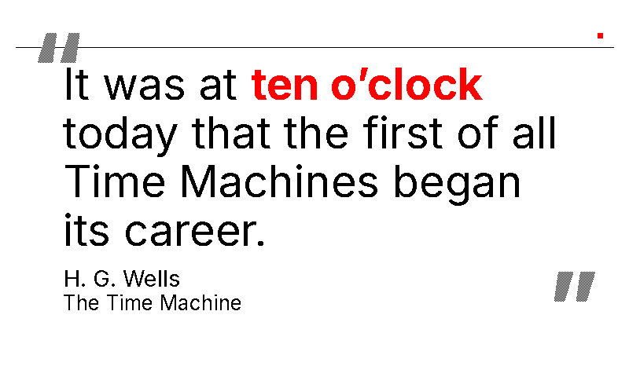

# `swiss` (retired)

Retired from the rotation, the renderer and the live docs. Everything the theme was is kept in this folder so it can be restored as it was; see [`../../README.md`](../../README.md) for how.

## README row

| `swiss`       |              | white       | black | red    | Inter (grotesque sans) | Swiss International modernist |

## Design notes (from `docs/themes.md`)

  - `swiss` (white/black/red, Inter grotesque sans) — Swiss International / mid-century modernist functional, the only theme in the rotation whose border decoration is deliberately *minimal*.

    **Decoration.** A single 1 px black hairline rule across the page at y=60 plus a tiny 6×6 px filled red square at (width-40, y=42) anchoring the asymmetric Müller-Brockmann / Vignelli grid. No frame, no corner ornaments, no Layer-0 wash — austerity by subtraction is the visual identity, a counterpoint to every other border-rich theme.

    **Debug band.** The square is positioned below the y=14-29 debug-banner band, so swiss is intentionally absent from `_DEBUG_LABEL_RIGHT_INSET`.

## Font notes (from `docs/themes.md`)

  - `swiss` uses **Inter** (Rasmus Andersson, OFL) — the de-facto open-source Helvetica replacement, a grotesque sans designed for UI rendering at small sizes. Variable font with Regular / Bold instances pinned explicitly. Visually distinct from Archivo (blueprint, grotesque) and Jost (bauhaus, geometric-constructed) so the three sans-based themes stay differentiable. Falls back through DejaVu / Liberation / Noto Sans before the Playfair chain.

## Registration

- `THEME_ORDER`: sat after `dark`.
- `display_inky.THEME_SATURATION`: `"swiss": 0.5,`

### `THEMES` entry (`render_quote/theme_tables.py`)

```python
    # Swiss International style: the least ornamented frame — its border
    # painter draws only a hairline rule near the top and a small red square.
    # Inter body, Inter Bold + red for the matched phrase.
    "swiss": {
        "page_bg": SPECTRA6["white"],
        "text": SPECTRA6["black"],
        "subtle": SPECTRA6["black"],
        "faint": SPECTRA6["black"],
        "accent": SPECTRA6["red"],
        "ornament_dark": SPECTRA6["black"],
        "ornament_light": SPECTRA6["white"],
        "source": SPECTRA6["black"],
    },
```

### `THEME_FONTS` entry (`render_quote/theme_tables.py`)

```python
    "swiss": {
        # Inter (grotesque). Every candidate pins its instance so the
        # matched-phrase bold is unambiguous; falls back through sans faces
        # before the Playfair chain so the theme stays sans.
        "quote_regular": [
            (INTER_VARIABLE, "Regular"),
            "/usr/share/fonts/truetype/dejavu/DejaVuSans.ttf",
            "/usr/share/fonts/truetype/liberation/LiberationSans-Regular.ttf",
            "/usr/share/fonts/truetype/liberation2/LiberationSans-Regular.ttf",
            "/usr/share/fonts/truetype/noto/NotoSans-Regular.ttf",
            *QUOTE_FONT_SEMIBOLD_CANDIDATES,
        ],
        "quote_bold": [
            (INTER_VARIABLE, "Bold"),
            "/usr/share/fonts/truetype/dejavu/DejaVuSans-Bold.ttf",
            "/usr/share/fonts/truetype/liberation/LiberationSans-Bold.ttf",
            "/usr/share/fonts/truetype/liberation2/LiberationSans-Bold.ttf",
            "/usr/share/fonts/truetype/noto/NotoSans-Bold.ttf",
            *QUOTE_FONT_BOLD_CANDIDATES,
        ],
        "ornament": [
            (INTER_VARIABLE, "Bold"),
            "/usr/share/fonts/truetype/dejavu/DejaVuSans-Bold.ttf",
            *ORNAMENT_FONT_CANDIDATES,
        ],
    },
```
